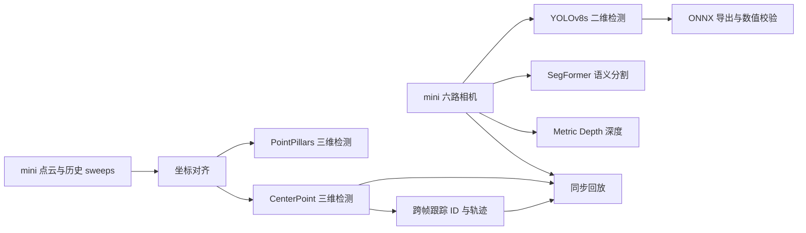

# CARperception

用 **nuScenes mini** 理解自动驾驶感知流程的学习工程。包含真实模型推理、坐标变换、检测、分割、深度、3D 检测、跟踪、ONNX 导出校验与同步回放。

## 流程与完成范围



- 图像三分支：首个时刻六路相机的真实推理。
- PointPillars：单帧及带历史 sweeps 的推理。
- CenterPoint 与跟踪：`scene-0061` 连续 **39 帧**。
- 导出：同一 mini 前视图的 PyTorch GPU / ONNX Runtime GPU 数值校验。
- 回放：原始前视图、三维检测、跟踪轨迹三栏同步；**2 fps 是播放速率，不是推理性能**。
- BEVFormer、BEVFusion、CenterFusion、MapTR、SurroundOcc、TensorRT 与训练作为扩展，尚未完成。

[下载教学回放视频](perception_lab/outputs/replay/mini_learning.mp4) · [学习顺序与逐步命令](perception_lab/LEARNING_GUIDE.md) · [当前工作状态](perception_lab/TASK_STATE.md)

## 仓库内容

| 路径 | 内容 |
|---|---|
| `perception_lab/tools/` | 数据处理、推理编排、导出、跟踪、报告和验证 |
| `perception_lab/tests/` | 坐标变换、证据完整性、执行状态等测试 |
| `perception_lab/configs/` | 执行配置、上游 commit 与兼容补丁 |
| `perception_lab/checkpoints/manifest.json` | 权重来源、大小与 SHA256 |
| `perception_lab/envs/*_freeze.txt` | 实际使用的依赖版本记录 |
| `perception_lab/outputs/replay/` | 教学视频 |
| `perception_lab/instruction/` | 原始完整规划；当前以 mini 学习范围为准 |

## 环境与复现边界

已验证环境为 Linux、RTX 4090、Python 3.10、PyTorch 2.1.2+cu118。视觉模型与 MMDetection3D 使用两个隔离环境，细节见 [兼容性记录](perception_lab/reports/compatibility.md)。版本冻结文件是环境记录，不保证任意机器直接安装成功。

数据集、模型权重、虚拟环境、第三方源码及原始运行目录不进入 Git。克隆仓库后需：

1. 按 `configs/locked/repositories.json` 获取对应上游源码并检出记录的 commit；按兼容性记录应用补丁。
2. 从 [nuScenes 官网](https://www.nuscenes.org/nuscenes) 获取 mini，解压至 `perception_lab/data/nuscenes/`。
3. 按 `checkpoints/manifest.json` 获取所需权重并核验 SHA256。
4. 建立 `envs/vision` 与 `envs/mmdet3d`，参照依赖记录配置环境。
5. 调整配置中的原机器绝对路径（`/home/minglei/Desktop/CAR` 等）为实际项目、数据及环境位置。历史运行目录须改成新生成的输出路径。
6. 依照 [学习说明](perception_lab/LEARNING_GUIDE.md) 逐步运行并生成本地 HTML 页面。

**当前仓库保留原机器的配置记录，尚不是跨机器一键安装包。** 学习说明中指向 `reports/mini_learning.html`、`runs/`、`results/` 的本地结果链接需要完成运行后生成；已提交的教学视频可直接下载观看。

现有针对性测试（需 MMDetection3D 环境）：

```bash
cd perception_lab
envs/mmdet3d/bin/python -m unittest discover -s tests -v
```

mini 结果用于理解流程，不代表全量验证集精度。原始计划的全量 A/B/C 验收已不作为当前学习目标；勿用旧的 `--phase all` 作为 mini 教学入口。

## 来源与使用条件

本工程调用的模型、第三方仓库、权重和 nuScenes 数据各有其使用条件，请遵守原作者许可。来源与固定版本记录见上述清单；本仓库不重新授权这些上游资产。
