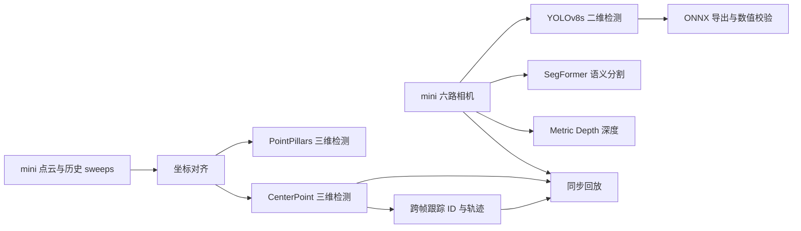

# CARperception

用 **nuScenes mini** 理解自动驾驶感知流程的学习工程。包含真实模型推理、坐标变换、检测、分割、深度、3D 检测、跟踪、ONNX 导出校验与同步回放。

## 流程与完成范围



- 图像三分支：首个时刻六路相机的真实推理。
- PointPillars：单帧及带历史 sweeps 的推理。
- CenterPoint 与跟踪：`scene-0061` 连续 **39 帧**。
- 导出：同一 mini 前视图的 PyTorch GPU / ONNX Runtime GPU 数值校验。
- 回放：原始前视图、三维检测、跟踪轨迹三栏同步；**2 fps 是播放速率，不是推理性能**。
- BEVFormer、BEVFusion、CenterFusion、MapTR、SurroundOcc、TensorRT 与训练作为扩展，尚未完成。

[下载教学回放视频](perception_lab/outputs/replay/mini_learning.mp4) · [学习顺序与逐步命令](perception_lab/LEARNING_GUIDE.md) · [当前工作状态](perception_lab/TASK_STATE.md)

## 各模块可视化入口

这些模块有可复用的可视化工具，但界面形态不同：**在线交互**可在浏览器操作，**本地 Web / 桌面**需安装并启动，**脚本 / 教程**需先准备模型和数据。下列链接优先选取作者仓库或官方文档；链接已核对，外部界面未逐个部署测试。最新文档可能使用新版模型或依赖，运行本项目时以锁定版本为准。

### 当前教学模块

| 模块 | 可视化链接 | 界面形态与用途 | 本项目接入情况 |
|---|---|---|---|
| M00 数据、标定与投影 | [nuScenes 官方可视化教程](https://www.nuscenes.org/tutorials/nuscenes_tutorial.html) | 本地 Notebook / 绘图窗口；`render_sample`、`render_sample_data`、`render_scene` 查看相机、点云、雷达、框及连续场景 | 已生成六相机投影与 BEV 图；未另建交互窗口 |
| M01 YOLOv8s 二维检测 | [官方预测结果可视化](https://docs.ultralytics.com/modes/predict)；[官方 Streamlit 界面教程](https://docs.ultralytics.com/guides/streamlit-live-inference) | 本地图片 / 视频窗口；Streamlit 可启动本地 Web 界面。文档当前以新版 YOLO 举例，需选择兼容的 YOLOv8s 权重 | 已生成检测叠加图；Streamlit 尚未接入 |
| M02 SegFormer 语义分割 | [作者图像 Demo](https://github.com/NVlabs/SegFormer#demo)；[MMSegmentation 可视化文档](https://mmsegmentation.readthedocs.io/en/latest/user_guides/visualization.html) | 本地脚本 / 绘图窗口；查看像素类别、原图与分割叠加图，需匹配 Cityscapes 类别与调色板 | 已生成分割图与类别数组 |
| M03 Depth Anything V2 深度 | [作者在线交互演示](https://huggingface.co/spaces/depth-anything/Depth-Anything-V2)；[本地 Gradio](https://github.com/DepthAnything/Depth-Anything-V2#gradio-demo)；[Metric Depth 分支](https://github.com/DepthAnything/Depth-Anything-V2/tree/main/metric_depth) | 在线上传图片 / 本地 Web。通用演示展示相对深度；本项目用 Metric Depth 权重，不能直接把通用演示颜色当作米制距离 | 已生成米制深度数组和深度图；未部署 Gradio |
| M04 PointPillars | [MMDetection3D 3D 可视化](https://mmdetection3d.readthedocs.io/en/latest/user_guides/visualization.html) | 本地 Open3D 交互窗口 / 离线图；旋转缩放点云、查看三维框，通常需要图形显示环境 | 已生成 BEV 框；Open3D 交互窗口尚未接入 |
| M05 CenterPoint | [MMDetection3D 3D 可视化](https://mmdetection3d.readthedocs.io/en/latest/user_guides/visualization.html)；[作者 Demo 脚本](https://github.com/tianweiy/CenterPoint/blob/master/tools/demo.py) | 本地 3D 查看器 / Demo；本项目使用 MMDetection3D 实现，优先参考前一个入口 | 已完成连续 39 帧检测与 BEV 回放 |
| M11 跨帧跟踪 | [nuScenes 跟踪渲染器源码](https://github.com/nutonomy/nuscenes-devkit/blob/master/python-sdk/nuscenes/eval/tracking/render.py)；[本项目跟踪可视化](perception_lab/tools/track_mini.py) | 本地渲染脚本；显示框、ID 与轨迹。官方渲染器需接入其评估数据结构，并非独立 Web 应用 | 已接入作者跟踪器并生成 39 帧轨迹视频 |
| M12 ONNX 导出与部署 | [Netron 浏览器界面](https://netron.app/)；[Netron 本地安装](https://github.com/lutzroeder/netron#install) | 浏览器 / 桌面模型结构查看器；打开导出的 `.onnx` 查看算子、张量形状和连接。数值一致性与速度仍需单独测试 | ONNX 导出与数值校验已完成；Netron 可自行打开模型，未嵌入项目 |
| M14 教学报告与回放 | [本项目同步回放视频](perception_lab/outputs/replay/mini_learning.mp4)；[教学页面生成器](perception_lab/tools/mini_learning.py)；[运行说明](perception_lab/LEARNING_GUIDE.md) | MP4 播放器 / 本地 HTML；同帧查看前视相机、检测与跟踪，并查看各模块静态结果 | 已生成 39 帧同步视频和本地 HTML；未托管为在线应用 |

### 扩展模块（尚未接入本教学闭环）

| 模块 | 官方可视化链接 | 界面形态与用途 |
|---|---|---|
| M06 BEVFormer | [作者可视化脚本](https://github.com/fundamentalvision/BEVFormer/blob/master/tools/analysis_tools/visual.py) | 本地脚本；将预测框绘制到多相机和 BEV，需要配置数据路径与结果文件 |
| M07 BEVFusion | [作者可视化脚本](https://github.com/mit-han-lab/bevfusion/blob/main/tools/visualize.py) | 本地脚本；导出相机、点云及预测 / GT 可视化，需准备配置、权重和数据 |
| M08 CenterFusion | [作者 Demo 脚本](https://github.com/mrnabati/CenterFusion/blob/master/src/demo.py)；[项目说明](https://github.com/mrnabati/CenterFusion) | 本地 Demo / 调试窗口；相机与雷达融合必须按作者数据管线准备雷达输入，普通图片 Demo 不代表雷达融合已运行 |
| M09 MapTR | [作者可视化与视频生成教程](https://github.com/hustvl/MapTR/blob/main/docs/visualization.md) | 本地脚本；`vis_pred.py` 显示矢量地图预测，`generate_video.py` 合并输入、输出及 GT |
| M10 SurroundOcc | [作者占用可视化教程](https://github.com/weiyithu/SurroundOcc/blob/main/docs/run.md) | 本地 MeshLab / Mayavi；查看 `.ply` 点云或 `.npy` 占用预测，需先获得模型推理结果 |
| M13 微调训练 | [MMEngine 可视化与 TensorBoard 后端](https://mmengine.readthedocs.io/en/latest/advanced_tutorials/visualization.html) | 本地 Web；配置 `TensorboardVisBackend` 后查看 loss、学习率和评估曲线。本项目尚未训练，无对应训练面板数据 |

建议先看本项目同步视频，再用深度在线 Demo 体验图像到预测结果，用 Netron 理解模型结构；想交互旋转点云时，再配置 MMDetection3D / Open3D。

## 多传感器数据查看与企业工程工具

工程中通常按工作任务选择查看工具：算法研发关注预测与中间结果，系统联调关注时间同步、坐标系和日志，数据团队关注样本筛选与标注。下面是可用于这些工作的代表性工具，不代表所有企业采用同一套软件。

| 工具与官方入口 | 界面形式 | 主要用途 | nuScenes 接入方式 |
|---|---|---|---|
| [Rerun：官方 nuScenes 示例](https://github.com/rerun-io/rerun/blob/main/examples/python/nuscenes_dataset/README.md) | 桌面 / Web 查看器 | 在统一时间轴查看多相机、点云、三维框及算法中间结果 | 从官方 nuScenes 加载示例开始，再将本项目模型输出写入对应时间与坐标系 |
| [Foxglove](https://docs.foxglove.dev/docs) | 浏览器 / 桌面 | 多传感器同步回放、三维场景、坐标变换、曲线和日志，适合系统联调 | 将原始文件和预测转换为支持的消息及 MCAP / ROS Bag，配置图像、3D 和曲线面板；参考 [多模态数据转 MCAP 示例](https://foxglove.dev/blog/working-with-scenes-and-pointclouds) |
| [RViz / RViz2：Marker 文档](https://docs.ros.org/en/rolling/Tutorials/Intermediate/RViz/Marker-Display-types/Marker-Display-types.html) | 桌面 | ROS 系统中的点云、坐标系、目标框与轨迹调试 | 将数据发布为图像、PointCloud2、Marker 等 ROS 消息，通过 TF 提供坐标关系，再实时显示或回放录制数据 |
| [FiftyOne：分组数据集](https://docs.voxel51.com/user_guide/groups.html) | 浏览器页面 | 按样本浏览多相机与点云、检查标签、筛选问题数据 | 构建 grouped dataset，导入相机 / 点云媒体和预测标签；按其支持格式做转换 |
| [CVAT：3D 标注](https://docs.cvat.ai/docs/manual/basics/3d-object-annotation/) | 浏览器页面 | 人工标注、修正三维框和审核数据 | 转换为支持的点云及标注格式，创建标注任务；更适合标注工作，不作为本项目的主要算法回放入口 |

### 本项目建议：先接 Rerun，再按需要接 Foxglove

**当前目标是用 mini 理解感知流程，建议优先采用 Rerun。** 官方已有 nuScenes 示例，可以先查看原始多传感器与 GT，再接入现有检测、深度和跟踪结果。若后续学习重点转向车端日志、消息流与系统联调，再采用 Foxglove + MCAP；已有 ROS 系统时可直接考虑 RViz2。

建议的交互布局如下，属于后续接入设计：

```text
┌──────────────────────┬──────────────────────┐
│ 六路相机：原图 / 叠加图 │ 可旋转的点云与三维框    │
│ 检测、分割、深度图层    │ GT、预测框、目标轨迹    │
├──────────────────────┴──────────────────────┤
│ 时间轴：播放、暂停、拖动、逐帧；图层与目标属性   │
└─────────────────────────────────────────────┘
```

接入时需保留 `sample_token`、传感器时间戳、相机内外参和自车位姿，并明确每份预测的坐标系。mini 已提供标定信息，但各传感器原始数据仍需正确变换到共同参考系；查看器不会自动修复错误的标定或时间关联。可参考 [nuScenes 官方数据与标定教程](https://www.nuscenes.org/tutorials/nuscenes_tutorial.html)。

**当前实现仍是本地 HTML + 同步视频，尚未接入 Rerun、Foxglove、RViz2、FiftyOne 或 CVAT。** 已完成的 39 帧检测 / 跟踪结果可以作为后续接入的数据源；图像检测、分割和深度目前只运行了首个时刻六路相机，接入查看器不会自动产生其余帧的模型预测。当前页面不支持交互旋转点云、切换三维图层或检查目标属性。

## 仓库内容

| 路径 | 内容 |
|---|---|
| `perception_lab/tools/` | 数据处理、推理编排、导出、跟踪、报告和验证 |
| `perception_lab/tests/` | 坐标变换、证据完整性、执行状态等测试 |
| `perception_lab/configs/` | 执行配置、上游 commit 与兼容补丁 |
| `perception_lab/checkpoints/manifest.json` | 权重来源、大小与 SHA256 |
| `perception_lab/envs/*_freeze.txt` | 实际使用的依赖版本记录 |
| `perception_lab/outputs/replay/` | 教学视频 |
| `perception_lab/instruction/` | 原始完整规划；当前以 mini 学习范围为准 |

## 环境与复现边界

已验证环境为 Linux、RTX 4090、Python 3.10、PyTorch 2.1.2+cu118。视觉模型与 MMDetection3D 使用两个隔离环境，细节见 [兼容性记录](perception_lab/reports/compatibility.md)。版本冻结文件是环境记录，不保证任意机器直接安装成功。

数据集、模型权重、虚拟环境、第三方源码及原始运行目录不进入 Git。克隆仓库后需：

1. 按 `configs/locked/repositories.json` 获取对应上游源码并检出记录的 commit；按兼容性记录应用补丁。
2. 从 [nuScenes 官网](https://www.nuscenes.org/nuscenes) 获取 mini，解压至 `perception_lab/data/nuscenes/`。
3. 按 `checkpoints/manifest.json` 获取所需权重并核验 SHA256。
4. 建立 `envs/vision` 与 `envs/mmdet3d`，参照依赖记录配置环境。
5. 调整配置中的原机器绝对路径（`/home/minglei/Desktop/CAR` 等）为实际项目、数据及环境位置。历史运行目录须改成新生成的输出路径。
6. 依照 [学习说明](perception_lab/LEARNING_GUIDE.md) 逐步运行并生成本地 HTML 页面。

**当前仓库保留原机器的配置记录，尚不是跨机器一键安装包。** 学习说明中指向 `reports/mini_learning.html`、`runs/`、`results/` 的本地结果链接需要完成运行后生成；已提交的教学视频可直接下载观看。

现有针对性测试（需 MMDetection3D 环境）：

```bash
cd perception_lab
envs/mmdet3d/bin/python -m unittest discover -s tests -v
```

mini 结果用于理解流程，不代表全量验证集精度。原始计划的全量 A/B/C 验收已不作为当前学习目标；勿用旧的 `--phase all` 作为 mini 教学入口。

## 来源与使用条件

本工程调用的模型、第三方仓库、权重和 nuScenes 数据各有其使用条件，请遵守原作者许可。来源与固定版本记录见上述清单；本仓库不重新授权这些上游资产。
