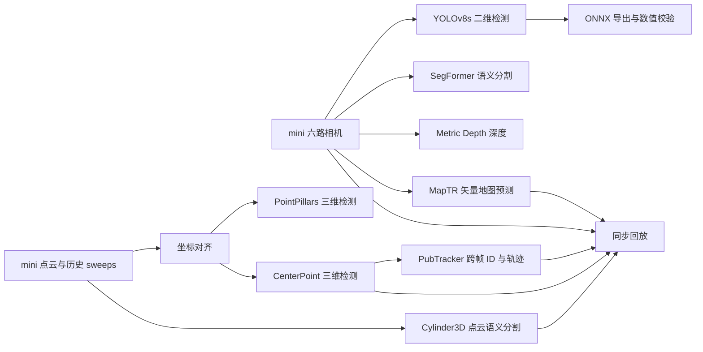

# CARperception

用 **nuScenes mini** 理解自动驾驶感知流程的学习工程。包含真实模型推理、坐标变换、检测、分割、深度、3D 检测、跟踪、ONNX 导出校验与同步回放。

## 流程与完成范围


```mermaid
flowchart LR
    A[mini 六路相机] --> B[YOLOv8s 二维检测]
    A --> C[SegFormer 语义分割]
    A --> D[Metric Depth 深度]
    E[mini 点云与历史 sweeps] --> F[坐标对齐]
    F --> G[PointPillars 三维检测]
    F --> H[CenterPoint 三维检测]
    H --> I[PubTracker 跨帧 ID 与轨迹]
    E --> L[Cylinder3D 点云语义分割]
    A --> M[MapTR 矢量地图预测]
    L --> K
    M --> K
    B --> J[ONNX 导出与数值校验]
    A --> K[同步回放]
    H --> K
    I --> K
```

- 图像三分支：首个时刻六路相机的真实推理。
- PointPillars：单帧及带历史 sweeps 的推理。
- CenterPoint 与 PubTracker 跟踪：`scene-0061` 连续 **39 帧**；Rerun 的 BEV、三维及六路相机使用一致的目标 ID 配色。
- Cylinder3D：当前场景 39 帧点云语义分割及官方真值对照；分割与目标跟踪并行，不做点云实例跟踪。
- 导出：同一 mini 前视图的 PyTorch GPU / ONNX Runtime GPU 数值校验。
- 回放：原始前视图、三维检测、跟踪轨迹三栏同步；**2 fps 是播放速率，不是推理性能**。
- MapTR 已完成 mini 场景 39 帧六相机推理及 Rerun 车道分隔线 / 道路边界 / 人行横道展示，详见 [实现与复现说明](perception_lab/MAPTR.md)。
- BEVFormer、BEVFusion、CenterFusion、SurroundOcc、TensorRT 与训练作为扩展，尚未完成。

[下载教学回放视频](perception_lab/outputs/replay/mini_learning.mp4) · [学习顺序与逐步命令](perception_lab/LEARNING_GUIDE.md) · [当前工作状态](perception_lab/TASK_STATE.md)

## 已公开的实验结果

| 文件 | 内容与时间范围 |
|---|---|
| [原始指标表](perception_lab/results/metrics.csv) | 2026-09-23：YOLO COCO val 5000 图及单时刻六相机稀疏深度诊断 |
| [历史总报告](perception_lab/reports/final_report.md) | 2026-09-23 快照；保留原全量 A/B/C 未达到的记录 |
| [阶段状态 JSON](perception_lab/results/status.json) | 截至 2026-09-24 的模型运行状态及产物哈希；后续评估另见下方报告 |
| [mini 教学验收 JSON](perception_lab/results/mini_learning.json) | 2026-09-23 教学阶段、run ID、39 帧 token 与视频记录 |
| [最新检测与跟踪评估](perception_lab/reports/mini_evaluation/report.md) | 39 帧固定阈值诊断、逐类别指标、身份事件及失败案例 |
| [MapTR 结果摘要](perception_lab/reports/published_results/maptr_summary.json) / [LiDARSeg 结果摘要](perception_lab/reports/published_results/lidarseg_summary.json) | 推理范围、配置和产物哈希；LiDARSeg 包含本场景诊断指标 |

原始数值：YOLO COCO AP **0.449536**、AP50 **0.617743**；深度 AbsRel **0.460359**、RMSE **8.299268 m**、δ1 **0.287418**。深度只覆盖首个时刻六相机的 22,055 个有效 LiDAR 投影像素，未做尺度对齐，不是全量深度基准。不同数据协议的指标不能直接比较。

上述结果现作为仓库文件发布。JSON 内的原机器绝对路径用于来源追溯，不是可在线下载链接；大型运行产物和数据仍需按复现说明生成。历史状态不替代 [最新工作状态](perception_lab/TASK_STATE.md)。

## 各模块可视化入口

这些模块有可复用的可视化工具，但界面形态不同：**在线交互**可在浏览器操作，**本地 Web / 桌面**需安装并启动，**脚本 / 教程**需先准备模型和数据。下列链接优先选取作者仓库或官方文档；链接已核对，外部界面未逐个部署测试。最新文档可能使用新版模型或依赖，运行本项目时以锁定版本为准。

### 当前教学模块

| 模块 | 可视化链接 | 界面形态与用途 | 本项目接入情况 |
|---|---|---|---|
| M00 数据、标定与投影 | [nuScenes 官方可视化教程](https://www.nuscenes.org/tutorials/nuscenes_tutorial.html) | 本地 Notebook / 绘图窗口；`render_sample`、`render_sample_data`、`render_scene` 查看相机、点云、雷达、框及连续场景 | 已生成六相机投影与 BEV 图；未另建交互窗口 |
| M01 YOLOv8s 二维检测 | [官方预测结果可视化](https://docs.ultralytics.com/modes/predict)；[官方 Streamlit 界面教程](https://docs.ultralytics.com/guides/streamlit-live-inference) | 本地图片 / 视频窗口；Streamlit 可启动本地 Web 界面。文档当前以新版 YOLO 举例，需选择兼容的 YOLOv8s 权重 | 已生成检测叠加图；Streamlit 尚未接入 |
| M02 SegFormer 语义分割 | [作者图像 Demo](https://github.com/NVlabs/SegFormer#demo)；[MMSegmentation 可视化文档](https://mmsegmentation.readthedocs.io/en/latest/user_guides/visualization.html) | 本地脚本 / 绘图窗口；查看像素类别、原图与分割叠加图，需匹配 Cityscapes 类别与调色板 | 已生成分割图与类别数组 |
| M03 Depth Anything V2 深度 | [作者在线交互演示](https://huggingface.co/spaces/depth-anything/Depth-Anything-V2)；[本地 Gradio](https://github.com/DepthAnything/Depth-Anything-V2#gradio-demo)；[Metric Depth 分支](https://github.com/DepthAnything/Depth-Anything-V2/tree/main/metric_depth) | 在线上传图片 / 本地 Web。通用演示展示相对深度；本项目用 Metric Depth 权重，不能直接把通用演示颜色当作米制距离 | 已生成米制深度数组和深度图；未部署 Gradio |
| M04 PointPillars | [MMDetection3D 3D 可视化](https://mmdetection3d.readthedocs.io/en/latest/user_guides/visualization.html) | 本地 Open3D 交互窗口 / 离线图；旋转缩放点云、查看三维框，通常需要图形显示环境 | 已生成 BEV 框；Open3D 交互窗口尚未接入 |
| M05 CenterPoint | [MMDetection3D 3D 可视化](https://mmdetection3d.readthedocs.io/en/latest/user_guides/visualization.html)；[作者 Demo 脚本](https://github.com/tianweiy/CenterPoint/blob/master/tools/demo.py) | 本地 3D 查看器 / Demo；本项目使用 MMDetection3D 实现，优先参考前一个入口 | 已完成连续 39 帧检测与 BEV 回放 |
| M09 MapTR | [本项目实现与复现](perception_lab/MAPTR.md) | Rerun 的 BEV、三维及相机投影 | 已完成 39 帧矢量地图预测与展示 |
| LiDARSeg / Cylinder3D | [本项目实现与复现](perception_lab/LIDARSEG.md) | Rerun 点云语义着色、独立真值页签 | 已完成 39 帧预测；BEV 同步着色 |
| M11 跨帧跟踪 | [nuScenes 跟踪渲染器源码](https://github.com/nutonomy/nuscenes-devkit/blob/master/python-sdk/nuscenes/eval/tracking/render.py)；[本项目跟踪可视化](perception_lab/tools/track_mini.py) | 本地渲染脚本；显示框、ID 与轨迹。官方渲染器需接入其评估数据结构，并非独立 Web 应用 | 已接入 PubTracker；39 帧轨迹视频及 Rerun BEV / 相机跟踪框、ID、BEV 轨迹 |
| M12 ONNX 导出与部署 | [Netron 浏览器界面](https://netron.app/)；[Netron 本地安装](https://github.com/lutzroeder/netron#install) | 浏览器 / 桌面模型结构查看器；打开导出的 `.onnx` 查看算子、张量形状和连接。数值一致性与速度仍需单独测试 | ONNX 导出与数值校验已完成；Netron 可自行打开模型，未嵌入项目 |
| M14 教学报告与回放 | [本项目同步回放视频](perception_lab/outputs/replay/mini_learning.mp4)；[教学页面生成器](perception_lab/tools/mini_learning.py)；[运行说明](perception_lab/LEARNING_GUIDE.md) | MP4 播放器 / 本地 HTML；同帧查看前视相机、检测与跟踪，并查看各模块静态结果 | 已生成 39 帧同步视频和本地 HTML；未托管为在线应用 |

### 扩展模块（尚未接入本教学闭环）

| 模块 | 官方可视化链接 | 界面形态与用途 |
|---|---|---|
| M06 BEVFormer | [作者可视化脚本](https://github.com/fundamentalvision/BEVFormer/blob/master/tools/analysis_tools/visual.py) | 本地脚本；将预测框绘制到多相机和 BEV，需要配置数据路径与结果文件 |
| M07 BEVFusion | [作者可视化脚本](https://github.com/mit-han-lab/bevfusion/blob/main/tools/visualize.py) | 本地脚本；导出相机、点云及预测 / GT 可视化，需准备配置、权重和数据 |
| M08 CenterFusion | [作者 Demo 脚本](https://github.com/mrnabati/CenterFusion/blob/master/src/demo.py)；[项目说明](https://github.com/mrnabati/CenterFusion) | 本地 Demo / 调试窗口；相机与雷达融合必须按作者数据管线准备雷达输入，普通图片 Demo 不代表雷达融合已运行 |
| M10 SurroundOcc | [作者占用可视化教程](https://github.com/weiyithu/SurroundOcc/blob/main/docs/run.md) | 本地 MeshLab / Mayavi；查看 `.ply` 点云或 `.npy` 占用预测，需先获得模型推理结果 |
| M13 微调训练 | [MMEngine 可视化与 TensorBoard 后端](https://mmengine.readthedocs.io/en/latest/advanced_tutorials/visualization.html) | 本地 Web；配置 `TensorboardVisBackend` 后查看 loss、学习率和评估曲线。本项目尚未训练，无对应训练面板数据 |

建议先看本项目同步视频，再用深度在线 Demo 体验图像到预测结果，用 Netron 理解模型结构；想交互旋转点云时，再配置 MMDetection3D / Open3D。

## 多传感器数据查看与企业工程工具

工程中通常按工作任务选择查看工具：算法研发关注预测与中间结果，系统联调关注时间同步、坐标系和日志，数据团队关注样本筛选与标注。下面是可用于这些工作的代表性工具，不代表所有企业采用同一套软件。

| 工具与官方入口 | 界面形式 | 主要用途 | nuScenes 接入方式 |
|---|---|---|---|
| [Rerun：官方 nuScenes 示例](https://github.com/rerun-io/rerun/blob/main/examples/python/nuscenes_dataset/README.md) | 桌面 / Web 查看器 | 在统一时间轴查看多相机、点云、三维框及算法中间结果 | 从官方 nuScenes 加载示例开始，再将本项目模型输出写入对应时间与坐标系 |
| [Foxglove](https://docs.foxglove.dev/docs) | 浏览器 / 桌面 | 多传感器同步回放、三维场景、坐标变换、曲线和日志，适合系统联调 | 将原始文件和预测转换为支持的消息及 MCAP / ROS Bag，配置图像、3D 和曲线面板；参考 [多模态数据转 MCAP 示例](https://foxglove.dev/blog/working-with-scenes-and-pointclouds) |
| [RViz / RViz2：Marker 文档](https://docs.ros.org/en/rolling/Tutorials/Intermediate/RViz/Marker-Display-types/Marker-Display-types.html) | 桌面 | ROS 系统中的点云、坐标系、目标框与轨迹调试 | 将数据发布为图像、PointCloud2、Marker 等 ROS 消息，通过 TF 提供坐标关系，再实时显示或回放录制数据 |
| [FiftyOne：分组数据集](https://docs.voxel51.com/user_guide/groups.html) | 浏览器页面 | 按样本浏览多相机与点云、检查标签、筛选问题数据 | 构建 grouped dataset，导入相机 / 点云媒体和预测标签；按其支持格式做转换 |
| [CVAT：3D 标注](https://docs.cvat.ai/docs/manual/basics/3d-object-annotation/) | 浏览器页面 | 人工标注、修正三维框和审核数据 | 转换为支持的点云及标注格式，创建标注任务；更适合标注工作，不作为本项目的主要算法回放入口 |

### 本项目已接入 Rerun

**当前使用 Rerun 理解 mini 感知流程。** 已接入原始多传感器、GT、三维检测、跟踪、点云分割与 MapTR 结果。若后续学习重点转向车端日志、消息流与系统联调，再采用 Foxglove + MCAP；已有 ROS 系统时可直接考虑 RViz2。

当前 Rerun 接入采用六相机、三维场景与统一时间轴布局：

```text
┌──────────────────────────┬──────────────────────────┐
│ BEV：语义点云、车道线      │ 六路相机：原图、车道线投影 │
│ 跟踪框、ID 与历史轨迹      │ 三维跟踪框投影、目标 ID    │
├──────────────────────────┤                          │
│ 三维点云、GT、检测与跟踪   │                          │
│ 分割预测 / 真值切换页签    │                          │
├──────────────────────────┴──────────────────────────┤
│ 时间轴：播放、暂停、拖动、逐帧                        │
└─────────────────────────────────────────────────────┘
```

接入时需保留 `sample_token`、传感器时间戳、相机内外参和自车位姿，并明确每份预测的坐标系。mini 已提供标定信息，但各传感器原始数据仍需正确变换到共同参考系；查看器不会自动修复错误的标定或时间关联。可参考 [nuScenes 官方数据与标定教程](https://www.nuscenes.org/tutorials/nuscenes_tutorial.html)。

**本地 Rerun 已接入并验证。** 现在可同步查看 39 帧的六路原始相机图、激光点云、GT、CenterPoint 检测框、PubTracker 轨迹及 MapTR 矢量地图预测，支持旋转缩放三维视图、切换图层及时间轴回放；原 HTML + 视频仍保留。Foxglove、RViz2、FiftyOne、CVAT 尚未接入。图像检测、分割和深度仍仅运行了首个时刻六路相机，不会自动产生其余帧预测；雷达与历史 sweeps 尚未接入 Rerun。

### 车道线识别与 BEV 展示

MapTR 使用六路图像和相机标定进行真实 GPU 推理；scene-0061 共 39 帧。独立 BEV 面板中：**黄色为分隔线、粉色为人行横道、蓝色为道路边界**，车辆前方朝上。默认置信度阈值 0.5，各帧合计显示 429 条预测（含重复时刻目标，并非 429 个独立道路元素）。三维场景及右侧六路相机图像也包含同一批预测；相机叠加通过标定投影，使用近似地面高度，不做车辆遮挡判断。

刷新现有 Rerun 页面即可加载新记录。用 `--lane-score` 重新导出可调整显示阈值；图层位于 `ego/maptr` 和 `bev/maptr`。这些线来自模型预测，不是加载地图真值。模型只预测平面位置，三维高度采用近似地面；未进行全量精度评估。安装、推理、坐标转换和代码位置见 [MAPTR.md](perception_lab/MAPTR.md)。

### LiDARSeg 点云语义分割

已补齐官方 mini 的 404 帧逐点标签，并用 nuScenes 专用 Cylinder3D 完成当前 scene-0061 的 39 帧、约 135 万点预测。Rerun 的 **LiDARSeg prediction / detections** 显示预测着色，**LiDARSeg ground truth** 页签显示独立真值；BEV 同步显示语义颜色。道路为青绿色、植被为绿色、人造结构为浅黄色、汽车为橙色。点云预测与相机车道线叠加均保留。

实现、类别、安装、复现命令及旧版算子兼容说明见 [LIDARSEG.md](perception_lab/LIDARSEG.md)。25 项测试、逐点录制核对与浏览器显示通过。当前场景诊断准确率约 95.16%，mini 与预训练数据重叠，不代表独立评估成绩。

### CenterPoint 目标跟踪与多视图显示

跟踪采用 **CenterPoint → PubTracker**，不依赖 LiDARSeg 分割结果，也不新增分割追踪模型。检测框和速度先转换到世界坐标；跟踪器按类别、速度回推位置和距离进行跨帧关联，沿用或分配目标 ID，再转换到当前自车坐标显示。

- **BEV**：旋转跟踪框、`#ID` 标签，以及同一 ID 最近最多 20 个显示位置的轨迹。
- **右侧六路相机**：通过标定投影三维跟踪框，显示简短 `#ID` 标签；这不是独立的图像目标跟踪。
- **三维视图**：跟踪框、ID 与轨迹采用同一套颜色。同一 ID 跨帧、跨视图颜色一致，颜色相近时以编号为准。
- **查看操作**：刷新下方本机查看器链接，播放或拖动时间轴。侧边栏默认收起；密集标签可能重叠，可放大对应视图。显示阈值默认 `score >= 0.25`，重新导出时可用 `--score` 调整。

各帧清除旧跟踪显示再重绘；漏检帧不显示预测补出的框。历史轨迹保存在世界坐标，再统一变换到当前自车坐标，避免把自车运动当作目标轨迹。ID 仍可能因漏检或错误关联改变。相机投影补偿自车位姿，但没有将动态目标外推到相机曝光时刻，也不判断遮挡，因此可能出现投影偏差。

代码入口：[跟踪编排与坐标变换](perception_lab/tools/track_mini.py)、[框投影与 ID 配色](perception_lab/tools/tracking_overlay.py)、[Rerun 图层与轨迹记录](perception_lab/tools/rerun_mini.py)。本次更新通过 28 项测试、39 帧 Rerun 记录校验及本机 Chrome 播放检查；属于教学流程验证，未进行全量跟踪精度评估。

### 检测、跟踪评估与失败案例

已对 scene-0061 的 **39 帧**完成固定阈值诊断：`score >= 0.25`、同类别地面中心距离 `< 2 m`，采用官方类别范围、零点真值与自行车架过滤。过滤后的真值已逐帧与 nuScenes devkit 核对一致。

| 分支 | 正确匹配 TP | 误检 FP | 漏检 FN | 精确率 | 召回率 |
|---|---:|---:|---:|---:|---:|
| CenterPoint 检测（10 类） | 2235 | 1020 | 75 | 68.66% | 96.75% |
| PubTracker 跟踪（7 类） | 1177 | 579 | 39 | 67.03% | 96.79% |

跟踪包含 **46 次连续帧 ID 切换**（其中行人 42 次）、**38 次间隔后换 ID**；另有 34 次同 ID 恢复。以上为逐帧目标次数，不是独立物体数；两分支不能相加。间隔可能来自漏检、过滤或离开范围，同 ID 恢复不直接认定为失败。检测中心平均误差为成功匹配目标上的 **0.229 m**，不包含漏检误差，也不评估框尺寸和朝向。

失败案例保存帧号、sample_token、类别、分数、距离及相关身份信息，可在 Rerun 的 `frame` 时间轴定位；10 张 BEV 案例图片用红色标漏检、紫色标误检、橙色标 ID 变化。

[完整评估报告与案例图片](perception_lab/reports/mini_evaluation/report.md) · [本地案例画廊](perception_lab/reports/mini_evaluation/index.html) · [全部案例 CSV](perception_lab/reports/mini_evaluation/cases.csv) · [逐帧统计](perception_lab/reports/mini_evaluation/frames.csv) · [分数阈值对比](perception_lab/reports/mini_evaluation/thresholds.csv)

```bash
cd perception_lab
envs/mmdet3d/bin/python tools/evaluate_mini.py --score 0.25 --distance 2.0
```

该脚本使用已有预测，不重新运行模型。检测采用分数排序贪心匹配；跟踪优先保留有效的前帧配对，再进行门限内匈牙利匹配。精确率、召回率与身份事件都依赖上述口径。**这是单场景教学诊断，不是官方 mAP、NDS、AMOTA 或独立测试成绩。** HTML 需本地打开，GitHub 不托管该页面；改用其他参数重新运行后，以生成报告为准。

### CenterPoint 官方代码检测评估

已用独立环境 `nuscenes-devkit==1.2.0` 的官方 `DetectionEval`、默认配置，评估 scene-0061 完整 39 帧：**mAP 0.699071，NDS 0.610700**。复用 8,399 个真实预测框，未新增 0.25 截断；40 项 AP 与官方 PR 曲线已复核。空属性导致 mAAE=1.0，bus/trailer 在该场景无有效真值，结果属于 **mini 单场景诊断，不是官方全 val 榜单成绩**。

[执行报告、口径及复现](perception_lab/reports/official_detection_mini/report.md) · [官方指标 JSON](perception_lab/reports/official_detection_mini/metrics/metrics_summary.json) · [完整 PR 数据](perception_lab/reports/official_detection_mini/metrics/metrics_details.json)。原固定阈值诊断和 M11 跟踪结果保持不变；完整 trainval val 评估为 `blocked_full_val`，缺全量数据及全 val 实测预测。

### Rerun 失败案例回放

已将固定阈值诊断接入 Rerun：左上切换 **Detection failures / BEV** 与 **Tracking failures / BEV**，红色=漏检、紫色=误检、橙色=ID 变化、黄色=中心误差>1m；右侧相机显示检测失败框，左下文本面板列出当前帧统计和案例编号。按 frame 时间轴定位，例如 frame 2 的 ID 变化、frame 29 的漏检。口径为 score≥0.25、2m，与官方 AP 四距离评估分开。

[操作、复现与验证报告](perception_lab/reports/rerun_failures/report.md)。默认加载失败案例；另设显示阈值时需使用相同阈值报告，或加 `--no-failures` 关闭失败层。

### 置信度与失败数量

选中目标时，**3D 视图通过移动相机自动拉近，保留当前帧全部点云**，不再裁剪目标附近的点云；切换事件成员同步更新取景。39 帧共 1,354,112 个点已与原始 LiDAR 逐帧核对，缩小视图可查看周围场景。[说明与验证](perception_lab/reports/full_pointcloud/report.md)。

当前回放**只按需加载并显示选中的异常框**，其他异常不同时出现；图像、点云、车道线保留，正常目标仍可选显示。[行为说明与验证](perception_lab/reports/selected_only/report.md)。

支持**逐帧人工标签修正**：可把原始 FP 标为“检测正确／GT 漏标”等判定，保存依据、按标签筛选、恢复原始标签和导出历史。编辑器位于案例详情底部，原始 GT 与指标保持可追溯。[使用与验证](perception_lab/reports/manual_case_labels/report.md)。

工作台支持按目标水平距离筛选：`0–10 m`、`10–20 m`、`20–40 m`、`≥40 m`。距离与置信度在同一条记录上联合判断，定位、高亮和特写同步选用符合条件的目标。[使用说明与验证](perception_lab/reports/distance_filter/report.md)。

选中异常事件后会显示**目标居中的相机特写**，自动选择投影较大的相机，BEV 同步居中放大；右下方保留六路完整画面。[功能说明与截图](perception_lab/reports/selection_focus/report.md)。

在左侧选择事件或逐帧案例时，BEV、3D 和可见相机中的对应目标会以**青白粗框高亮**；展开事件后可逐条切换。正常目标开关保留选择，离开案例所在帧后清除高亮。[实现与验证](perception_lab/reports/selection_highlight/report.md)。

异常框现采用细线，BEV、3D 和相机图默认隐藏常驻编号，避免遮挡小目标；完整编号和 ID 转换信息可在案例详情与帧摘要中查看。[样式调整与截图](perception_lab/reports/compact_failure_labels/report.md)。

失败工作台现已支持按置信度区间筛选事件、分组和逐帧案例，FN 单列“无置信度”；点击事件定位到符合筛选的帧。复核文本编辑面板已移除，历史记录保留。[使用口径与验证](perception_lab/reports/confidence_filter/report.md)。

失败相对自车的位置及潜在驾驶影响见[空间分布报告](perception_lab/reports/spatial_failure_analysis/report.md)，包含五区域 FN/FP/ID 切换统计和近前方漏检的 Rerun 入口。区域仅用于筛查，项目尚未验证规划或控制层面的实际影响。

已统计 scene-0061 的10个分数阈值下 FN、FP、ID切换，并对当前0.25基线失败按置信度分档。FN没有匹配预测，分数为N/A；ID切换取当帧新ID的预测分数。跟踪阈值表是已有轨迹输出的后置筛选重评，不是重跑跟踪器。[完整表格、图表与复现](perception_lab/reports/confidence_analysis/analysis-report.md)。

### 失败事件归并与复核工作台

**异常优先显示**：9092 默认只加载失败框，保留图像、点云和车道线背景。勾选顶部“显示正常目标（按需加载）”后叠加淡绿色正常框；取消即可隐藏。点击事件时自动切换对应检测/跟踪分支，开关保持当前帧。[规则、复现与验证](perception_lab/reports/failure_display/report.md)。


[本机工作台](http://127.0.0.1:9092/) 已支持 **原始案例 → 目标事件 → 问题分组 → 复核 → 片段回放**。当前 1910 条失败记录归并为 1268 个事件、84 个现象分组；复核可记录负责人、根因、措施与验证证据，本地持久保存并导出。事件数下降不是模型精度提升，FP 关联仍需复核。

默认按事件浏览，切换“问题分组排行榜”后可下钻；点击事件定位代表帧，或播放同场景前后2秒并自动暂停。原始案例、模型输出和评估指标保留。[完整规则、结果与复现报告](perception_lab/reports/failure_events/report.md)。

### 可点击的嵌入式案例浏览器

运行 `cd perception_lab && envs/rerun/bin/python tools/start_case_browser.py`，打开 [本机案例浏览器](http://127.0.0.1:9092/)。按分支、失败类型、目标类别或编号筛选，点击案例后自动暂停并跳到对应 frame，BEV 与六路图像同步更新；支持上一条／下一条及 `#case_XXXXX` 定位链接。等待完整记录加载后启用跳转。

[操作与复现报告](perception_lab/reports/embedded_case_browser/report.md)。工作台查看器与按需取景组件使用 Rerun 0.27.3，兼容现有 0.23.4 录制，无需模型重推理；原 9090 查看器仍保留。取景组件的独立环境安装见[完整点云报告](perception_lab/reports/full_pointcloud/report.md)。

### 本地启动 Rerun

本机已安装独立环境并生成记录。启动与停止命令：

```bash
cd perception_lab
envs/rerun/bin/python tools/start_rerun.py
# 已有推理结果时，重新导出显示图层（可选）
# envs/rerun/bin/python tools/rerun_mini.py --score 0.25
# 停止：envs/rerun/bin/python tools/start_rerun.py --stop
```

[本机查看器](http://127.0.0.1:9090/?url=http%3A%2F%2F127.0.0.1%3A9091%2Fmini_scene.rrd&renderer=webgl) · [安装、导出、操作与坐标说明](perception_lab/RERUN.md)

本机链接需要服务运行，GitHub 不托管该界面。克隆后需准备数据和既有运行结果，按说明安装 `rerun-sdk==0.23.4` 并导出记录；`outputs/rerun/` 中的记录、日志和截图不上传仓库。

## 仓库内容

| 路径 | 内容 |
|---|---|
| `perception_lab/tools/` | 数据处理、推理编排、导出、跟踪、报告和验证 |
| `perception_lab/tests/` | 坐标变换、证据完整性、执行状态等测试 |
| `perception_lab/configs/` | 执行配置、上游 commit 与兼容补丁 |
| `perception_lab/checkpoints/manifest.json` | 权重来源、大小与 SHA256 |
| `perception_lab/envs/*_freeze.txt` | 实际使用的依赖版本记录 |
| `perception_lab/outputs/replay/` | 教学视频 |
| `perception_lab/instruction/` | 原始完整规划；当前以 mini 学习范围为准 |

## 环境与复现边界

已验证环境为 Linux、RTX 4090、Python 3.10、PyTorch 2.1.2+cu118。视觉模型与 MMDetection3D 使用两个隔离环境，细节见 [兼容性记录](perception_lab/reports/compatibility.md)。版本冻结文件是环境记录，不保证任意机器直接安装成功。

数据集、模型权重、虚拟环境、第三方源码及原始运行目录不进入 Git。克隆仓库后需：

1. 按 `configs/locked/repositories.json` 获取对应上游源码并检出记录的 commit；按兼容性记录应用补丁。
2. 从 [nuScenes 官网](https://www.nuscenes.org/nuscenes) 获取 mini，解压至 `perception_lab/data/nuscenes/`。
3. 按 `checkpoints/manifest.json` 获取所需权重并核验 SHA256。
4. 建立 `envs/vision` 与 `envs/mmdet3d`，参照依赖记录配置环境。
5. 调整配置中的原机器绝对路径（`/home/minglei/Desktop/CAR` 等）为实际项目、数据及环境位置。历史运行目录须改成新生成的输出路径。
6. 依照 [学习说明](perception_lab/LEARNING_GUIDE.md) 逐步运行并生成本地 HTML 页面。

**当前仓库保留原机器的配置记录，尚不是跨机器一键安装包。** 学习说明中指向 `reports/mini_learning.html`、`runs/`、`results/` 的本地结果链接需要完成运行后生成；已提交的教学视频可直接下载观看。

现有针对性测试（需 MMDetection3D 环境）：

```bash
cd perception_lab
envs/mmdet3d/bin/python -m unittest discover -s tests -v
```

mini 结果用于理解流程，不代表全量验证集精度。原始计划的全量 A/B/C 验收已不作为当前学习目标；勿用旧的 `--phase all` 作为 mini 教学入口。

## 来源与使用条件

本工程调用的模型、第三方仓库、权重和 nuScenes 数据各有其使用条件，请遵守原作者许可。来源与固定版本记录见上述清单；本仓库不重新授权这些上游资产。

### 跟踪 max_age 对照实验

固定 CenterPoint 检测，在 39 帧上实测 max_age=1/2/3/4/5/8/10/20：3→4 的行人身份错误合计仅减少 2.6%，继续增大反而增加；2 在本次对照中合计最低，减少 9.2%。默认参数仍为 3，尚需跨场景验证。[完整指标、事件与复现报告](perception_lab/reports/max_age_sweep/report.md)。
