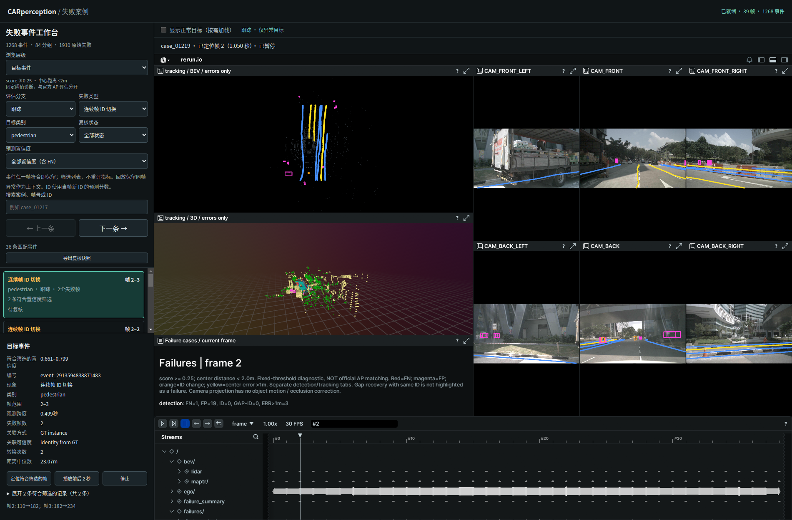

# 异常标签减少遮挡

2026-09-29。scene-0061，39 帧，Rerun 0.23.4。

问题：BEV、3D 和相机视图中的常驻编号底板覆盖小目标，ID 转换字符串进一步增加文字面积。

调整：

- 三类视图统一设置 `show_labels=False`，默认只显示异常颜色和框线。不是修改字体字号，而是取消常驻文字遮挡。
- 框线半径统一为 1 UI point；此前 BEV 和相机框为 2 UI points。
- 保留可检查的短标签，例如 `FP 1214`；删除前导零和标签中的 ID 转换长串。
- 完整 case_id 保存在记录属性中，3D 框也补充 case_id/class_name。事件详情和当前帧文本摘要仍显示完整案例与转换信息。

没有更改预测、评估、置信度筛选和案例编号。原始 mini_scene 录制未重新生成；当前 9092 工作台使用重新导出的 triage_scene 及配套正常目标录制。已打开的页面需刷新以加载新录制。

复现：

```bash
perception_lab/envs/rerun/bin/python perception_lab/tools/rerun_mini.py --triage-only
/usr/bin/python3 perception_lab/tests/browser_display_layers.py --out /tmp/car_compact_labels
perception_lab/envs/mmdet3d/bin/python -m unittest discover -s perception_lab/tests -p 'test_*.py'
```

验证：53 项 Python 测试通过。Browser plugin not available，使用系统 Playwright/Chrome，在 1900×1250、700×950 视口验证页面与截图；页面异常为空，切换正常目标前后仍停在同一记录的帧 2，正常目标仅下载一次，事件片段结束暂停。人工查看截图确认 BEV、3D 与相机图无常驻编号，框线与背景正常。未单独验证悬停提示行为，不将其作为查看编号的唯一入口。

产物：[录制来源及哈希](recording.json)、[浏览器验证](verification.json)、[测试日志](tests.log)、[导出日志](export.log)。大型录制按项目约定保留在本地。


