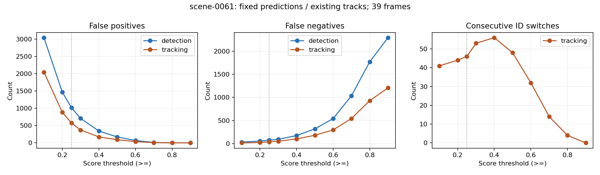

# 置信度与失败数量

2026-09-29。scene-0061，39帧；原有模型与轨迹输出，未重新推理或训练。
统计单位为逐目标逐帧失败及身份转换次数，不是1268个归并事件。检测10类、跟踪7类，分支之间不能直接用数量比较优劣。

## 不同筛选阈值下重新评估

每个阈值都重新执行原匹配和身份评估，不能把固定0.25阈值的失败简单筛选来替代。跟踪使用既有轨迹输出再筛分数，不是改变检测门限后重跑跟踪器；生产系统效果需另做完整跟踪重跑。

| 阈值 ≥ | 检测 FN | 检测 FP | 跟踪 FN | 跟踪 FP | 连续 ID 切换 | 间隔后换 ID |
|---:|---:|---:|---:|---:|---:|---:|
| 0.10 | 34 | 3042 | 16 | 2045 | 41 | 34 |
| 0.20 | 55 | 1467 | 25 | 885 | 44 | 36 |
| 0.25 | 75 | 1020 | 39 | 579 | 46 | 38 |
| 0.30 | 95 | 709 | 53 | 374 | 53 | 36 |
| 0.40 | 174 | 344 | 102 | 173 | 56 | 38 |
| 0.50 | 320 | 173 | 181 | 92 | 48 | 33 |
| 0.60 | 542 | 69 | 297 | 38 | 32 | 32 |
| 0.70 | 1036 | 12 | 544 | 7 | 14 | 26 |
| 0.80 | 1771 | 2 | 930 | 1 | 4 | 11 |
| 0.90 | 2292 | 0 | 1207 | 0 | 0 | 0 |

## 固定阈值0.25下，按失败预测的分数分档

FN没有匹配预测，因此没有预测置信度。检测FN=75、跟踪FN=39，均单列N/A；不把FN当作0分预测，也不采用附近误匹配框的分数。
ID切换用切换当帧新ID对应预测的score，不是ID关联可信度；旧ID分数不用于本次分档。区间左闭右开，最后一档含1。

| 分数区间 | 检测 FP | 跟踪 FP | 连续 ID 切换 | 间隔后换 ID |
|---|---:|---:|---:|---:|
| [0.25,0.40) | 676 | 372 | 5 | 13 |
| [0.40,0.60) | 275 | 137 | 19 | 11 |
| [0.60,0.80) | 67 | 62 | 18 | 14 |
| [0.80,1.00] | 2 | 8 | 4 | 0 |

分档表与阈值表含义不同：阈值提高后匹配关系可能变化，ID切换和断轨统计尤其不能通过简单删除低分事件得到。

## 复现

```bash
perception_lab/envs/mmdet3d/bin/python perception_lab/tools/analyze_failure_confidence.py
```

当前0.25基线逐条案例与总计完全复现，FP/FN/ID分档总和核对通过。原评估、事件和Rerun数据没有改写。

## 产物

- threshold_sweep.csv / threshold_by_class.csv：各阈值总计和类别统计。
- confidence_bins.csv / confidence_bins_by_class.csv：基线失败的分数分档。
- cases_with_confidence.json / csv：每条原始case_id及分数来源，可回溯原预测。
- summary.json：口径、参数、哈希。
- stats-appendix.md：统计限制；figure-catalog.md：图表说明。



## 观察与验证

阈值0.25→0.50：检测FP 1020→173，FN 75→320；跟踪FP 579→92，FN 39→181，连续ID切换46→48。提高阈值过滤误检，同时丢失真实目标，不能只用FP或ID次数选择最优门限。
基线46次连续ID切换中，分数≥0.60的有22次；较高检测分数不能保证身份关联正确。
当前工作台仍使用原0.25诊断，本次统计不覆盖原指标文件。
52项Python检查通过，包括新增FN无分数、当前ID分数绑定、分档边界检查。
