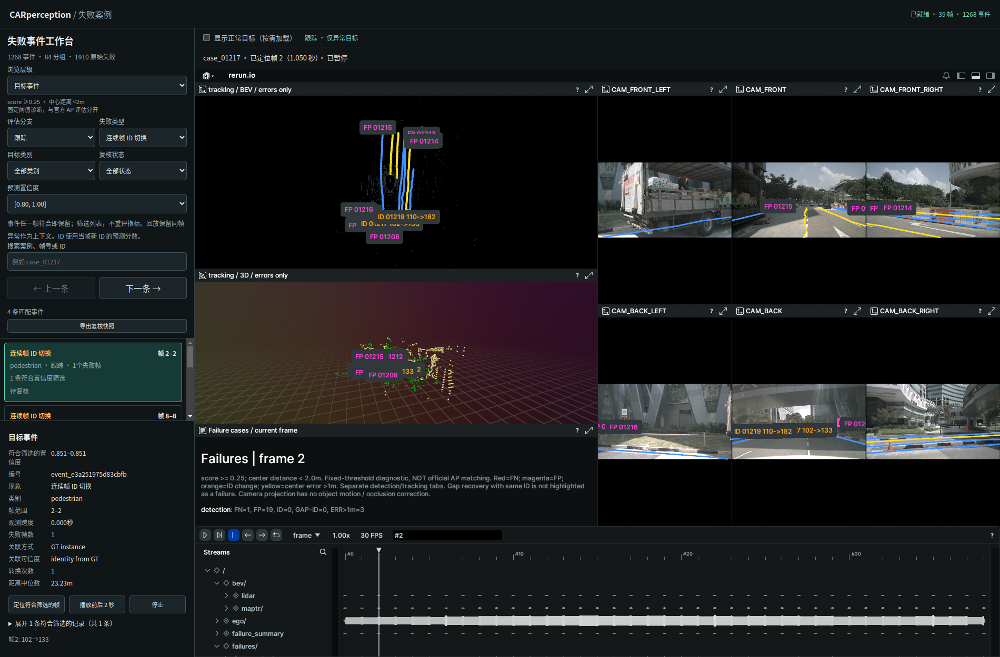
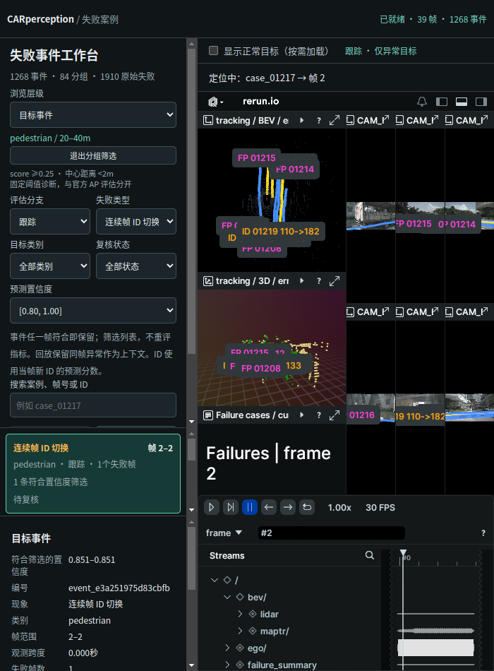

# 失败事件置信度筛选与复核输入移除

2026-09-29。针对当前 scene-0061 的 39 帧、固定分数门限 0.25 的失败工作台。

- 新增全部、[0.25,0.40)、[0.40,0.60)、[0.60,0.80)、[0.80,1.00]、无置信度（FN）六个选项。
- 事件任意一条观测符合即保留；分组任意一条成员观测符合即保留。原始逐帧视图直接按该条分数筛选。详情只展开符合筛选的成员，显示分数。
- 定位优先使用符合筛选的原代表帧，否则定位第一个符合条件的成员。事件时间范围及前后 2 秒播放仍保留完整上下文。空结果清空详情，提示画面保留上一帧。
- 置信度只筛选列表，Rerun 仍显示同帧同分支其他异常作为上下文；正常目标仍由原勾选项控制。没有重新推理、重跑跟踪或重评指标。
- 移除复核编辑表单及保存按钮。已有本地记录、状态筛选和快照导出继续保留，不删除历史数据。后端复核 API 仍保留兼容性。

## 分数与数据一致性

FN 为 null，不能当作 0 分。FP 用原预测框 score；位置误差用 matched_prediction_index 指向的预测；ID 切换、断续换 ID 和恢复用当帧目标 ID 的预测分数，不是关联可信度。

[scores.json](scores.json) 保存 1944 条原始案例的分数，其中 114 条 FN 为 null。34 条恢复记录仍不纳入失败列表。导出先验证原评估数据源一致性，保留预测文件哈希；前端验证 cases SHA-256、全量分数及 FN/null 关系。原 cases 文件与 Rerun 录制哈希不变。

## 复现

```bash
perception_lab/envs/mmdet3d/bin/python perception_lab/tools/export_case_confidence.py
python3 perception_lab/tools/start_case_browser.py --stop
python3 perception_lab/tools/start_case_browser.py --no-browser
node --experimental-modules perception_lab/tests/test_confidence_filter.mjs
perception_lab/envs/mmdet3d/bin/python -m unittest discover -s perception_lab/tests -p 'test_*.py'
/usr/bin/python3 perception_lab/tests/browser_confidence_filter.py --out /tmp/car_confidence_filter
/usr/bin/python3 perception_lab/tests/browser_event_workflow.py --out /tmp/car_confidence_event_regression
```

## 验证

- 53 项 Python 测试通过；新增位置误差分数来源测试先失败后通过。
- JavaScript 区间端点、FN、事件/分组成员筛选测试先失败后通过；原片段播放测试通过。
- Browser plugin not available，使用系统 Playwright + Chrome，在 `http://127.0.0.1:9092/` 验证。视口 1900×1250 与 700×950。
- 页面标题与主体正常，无页面运行异常；FN 为 97 事件 / 114 逐帧记录，高分 FP 为 10 条（其中检测 2 条），高分连续 ID 切换 4 条，和已有统计一致。
- 验证筛选后的事件定位、分组下钻保留条件、空结果、输入框移除；原流程验证 ID 帧 2 跳转与片段结束帧 6 暂停。
- 未改变模型精度，不代表工业场景验证。仅验证 Chrome，未验证其他浏览器。

证据：[筛选验证](verification.json)、[流程回归](event_verification.json)、[Python 日志](tests.log)。



