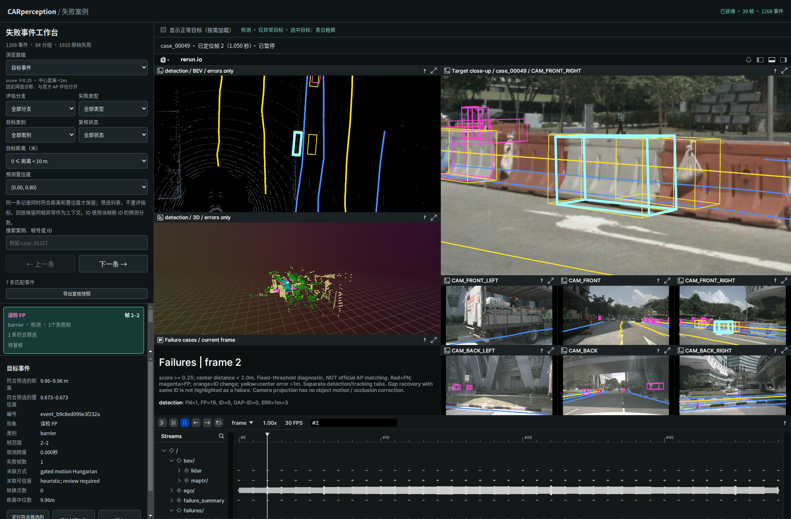
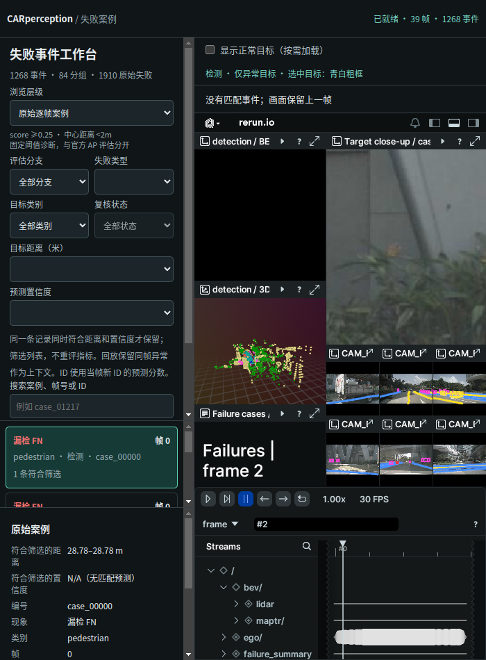

# 失败目标距离筛选

2026-09-29。适用于当前 scene-0061、39 帧失败事件工作台。

新增“目标距离（米）”下拉框：全部、[0,10)、[10,20)、[20,40)、[40,+∞)。区间左闭右开，10/20/40 米分别归入后一档。

使用原始案例的 `distance_m`：全局 XY 平面内目标中心到自车参考位姿的欧氏距离，不包含高度，不是纵向距离或 TTC。FP 使用预测框；FN、定位误差及身份诊断沿用原评估记录使用的 GT 位置。不修改原始数据与评估指标。

逐帧案例直接筛选。事件或分组必须至少有一条成员记录同时满足距离和置信度才保留，不允许分别从两个不同帧凑齐条件。事件详情仅展开符合条件的记录，并显示距离；定位、高亮与居中特写也使用符合条件的记录。事件时间范围和片段播放仍保留完整上下文。列表中的事件/分组总量不等于独立目标数或风险率。

该功能筛选左侧列表，回放仍保留同帧其他异常作为上下文，正常目标由原开关控制。清空距离条件可恢复全部距离；筛选无结果时清空详情和高亮。

## 实现与复现

`event_logic.mjs` 增加 distanceMatches，并将距离与置信度在同一条记录上取交集；`event_ui.js` 接入筛选、计数、成员列表及距离详情；`index.html` 添加控件。无需重新推理、导出录制或重启服务，刷新页面即可。

```bash
node --experimental-modules perception_lab/tests/test_distance_filter.mjs
node --experimental-modules perception_lab/tests/test_confidence_filter.mjs
node --experimental-modules perception_lab/tests/test_event_logic.mjs
node --experimental-modules perception_lab/tests/test_display_layers.mjs
/usr/bin/python3 perception_lab/tests/browser_distance_filter.py --out /tmp/car_distance
```

## 验证

距离边界、无距离值、FN、事件/分组与置信度交集测试先失败后通过；置信度、片段播放与显示图层测试通过。Browser plugin not available，使用系统 Playwright/Chrome，桌面 1900×1250 与窄屏 700×950。浏览器检查四个区间在事件、分组和逐帧三个层级的计数，直接对照原始 JSON 独立计算；还验证联合条件定位、高亮、FN、空结果清除以及重置后恢复 1910 条失败。

完整计数、页面异常检查及所选案例见 [verification.json](verification.json)。未验证其他浏览器。本次为浏览功能修改，不是新模型评估。



