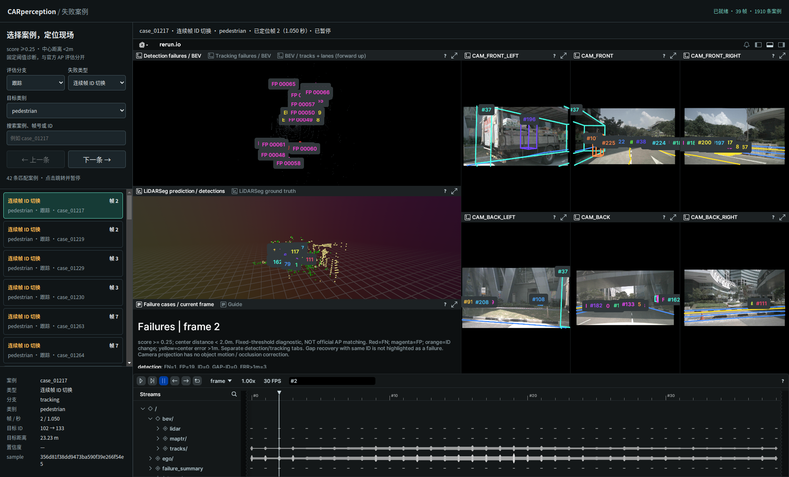

# 嵌入式失败案例浏览器

2026-09-28。将固定版本 Rerun WebViewer 0.23.4 嵌入本地页面，复用已有 mini_scene.rrd 与固定阈值失败案例，不重新推理或修改评估。

## 入口与操作

启动后访问 **http://127.0.0.1:9092/**。首次加载需解析完整 39 帧记录，期间列表可筛选但不能跳转；状态显示“已就绪”后启用按钮。

1. 筛选检测／跟踪、失败类型和目标类别，也可搜索案例编号、帧号、预测 ID 或真值实例 token。
2. 点击案例：暂停播放，切换 `frame` 时间轴，跳到案例帧；BEV、六路图像与帧内失败清单联动更新。
3. 左侧详情显示案例编号、类别、帧／秒、ID 变化、距离、分数、sample token；顶部显示实际定位确认。上一条／下一条在当前筛选结果中导航。
4. 切换 Rerun 内 Detection failures / Tracking failures 页签查看对应分支；案例选择不会自动切换 Viewer 内的页签或三维相机视角。
5. 地址中的 `#case_XXXXX` 可保存并分享本机案例定位，例如 `http://127.0.0.1:9092/#case_01217`。打开后在记录就绪时自动定位。

同 ID 恢复 `gap_recovery` 不列为失败；1910 条可浏览事件包括已匹配目标中心误差标记，不能直接相加作为 FP/FN。口径仍为 score≥0.25、同类别中心距离<2m，与官方 AP 评估分开。

## 启动与停止

从 perception_lab 目录运行：

```bash
envs/rerun/bin/python tools/start_case_browser.py
# 不自动打开浏览器
envs/rerun/bin/python tools/start_case_browser.py --no-browser
# 停止本项目案例浏览器进程
envs/rerun/bin/python tools/start_case_browser.py --stop
```

默认只监听 127.0.0.1:9092，可用 `--port` 指定空闲端口。此服务直接提供录制文件，不依赖 9090/9091 服务；原 Rerun 页面可继续使用。首次启动从 npm 下载官方包并核对固定 SHA512；之后从本机提供 JS/WASM，未使用 CDN。下载资源和服务状态存于忽略目录 outputs/case_browser/，代码和依赖校验值进入仓库。

## 实现与一致性

- `web/case_browser/`：页面、样式、筛选、详情、跳转控制；沿用 Rerun 深色界面。
- `tools/start_case_browser.py`：启动、停止、固定版本资源下载和本机白名单文件服务。
- 以 cases.json 原始字节 SHA256 核对录制摘要的 failure_report_sha256，防止案例与记录不一致。
- `set_playing(false)` → `set_active_timeline('frame')` → `set_current_time(frame)`；调用后读取实际帧、活动时间轴与暂停状态，成功才显示定位完成。快速连续点击只确认最后一次请求。
- 失败框按“帧／分支／类型”批量记录，每个框仍保留案例编号；减少独立实体和加载开销。重新导出的 39 帧摘要与原记录逐帧一致。
- 页面不会修改 Rerun 的模型结果、评估统计或跟踪 ID。

浏览器应支持 WebGL；首次解析约 141 MiB 的录制文件需要等待，本机浏览器测试约 3 分钟；页面显示已解析帧数。密集目标标签可能重叠，可放大 Viewer 视图。此页面是本机工具，GitHub 不托管交互服务。

## 测试

筛选与跳转顺序单元测试：`node --experimental-modules tests/test_case_browser.mjs`（本机 Node 10；现代 Node 可直接运行该文件）。浏览器实际接口读回、筛选、上一条／下一条、空结果与窄窗口检查见 verification.json 和截图。

官方接口依据：[固定版本 WebViewer 源码](https://github.com/rerun-io/rerun/blob/0.23.4/rerun_js/web-viewer/index.ts)。

复现实际浏览器检查（本机 /usr/bin/python3 已安装 Playwright，使用 /usr/bin/google-chrome 有界面模式）：

```bash
envs/mmdet3d/bin/python -m unittest discover -s tests
node --experimental-modules tests/test_case_browser.mjs
/usr/bin/python3 tests/browser_case_browser.py --out /tmp/car-case-browser-check
```

首次用 nuscenes_eval 环境执行完整 Python 测试时，已有 sweep loader 测试因缺少 mmdet3d 无法导入；使用项目 mmdet3d 环境运行后 37 项全部通过。浏览器测试发现并修复了检测下拉选项标签错误。

验证通过：39 帧、1910 条事件；行人 ID 切换筛选得到 42 条，点击 case_01217 后读回 frame=2、timeline=frame、playing=false；检测 FN 返回 frame=0。定位链接、前后切换、空筛选与窄窗口检查通过，浏览器 pageerror 为空。



[验证结果](verification.json) · [窄窗口截图](narrow.png)
