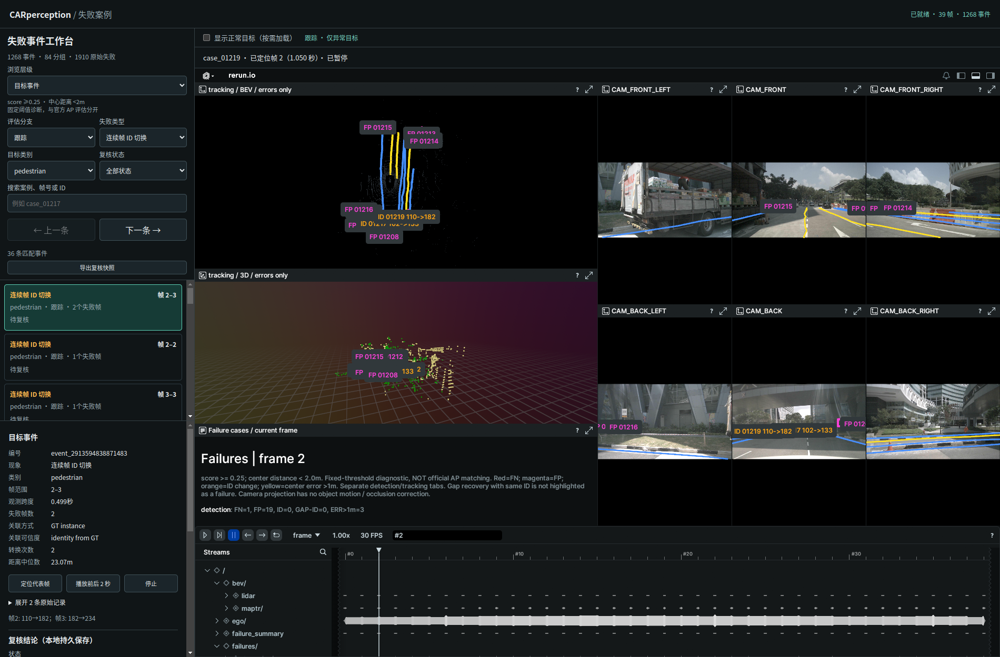
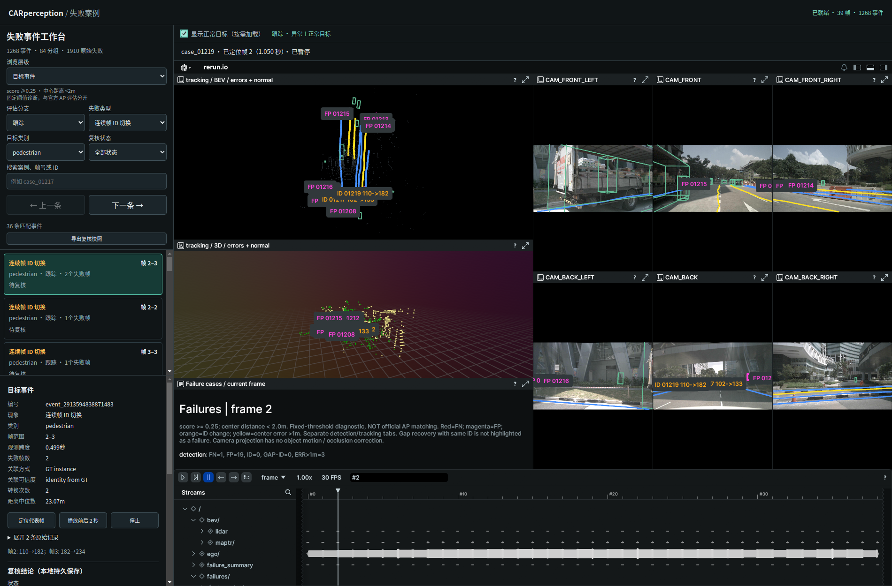

# 异常默认显示与正常目标按需加载

2026-09-29。针对 mini 39 帧异常事件工作台：默认只加载失败目标框；图像、点云、车道线作为定位背景保留。当前分支的同帧失败仍全部显示，不把单个已选事件之外的其他失败当作正常。

## 使用

刷新 http://127.0.0.1:9092/ 。顶部“显示正常目标（按需加载）”默认不勾选。点击事件时，BEV、3D 和六路相机自动选择检测或跟踪分支，保持 frame 同步。

- 未勾选：只有该分支的漏检、误检、定位误差、ID切换等失败框。漏检等使用对应 GT 框定位，不能解读为模型实际输出了漏检框。
- 勾选：首次请求 normal_targets.rrd；淡绿色细框叠加正常目标，默认不显示正常框标签，避免遮挡异常。
- 取消：隐藏正常图层，已下载的数据保留在 Viewer 缓存；再次勾选无需重下载。
- 开关切换暂停片段播放并保持当前记录与当前帧。图层布局重建后，3D可能需要数秒完成渲染；不是重新加载整段场景。
- 左侧事件清单仍只包含失败事件。“正常目标”是场景中的对照图层，不会伪造正常事件清单或改变事件归并。
- 9090 原完整流程查看器继续使用原 mini_scene.rrd。9092 改为独立 triage_scene.rrd，互不覆盖。

## 正常目标定义

重新执行既有 score≥0.25、同类全局XY中心距离<2m的诊断匹配，逐条断言重算 cases 与原始1944条记录完全一致、totals也一致。只纳入成功匹配的预测，排除中心误差>1m、连续 ID 切换与间隔后换 ID 对应的预测。gap_recovery 不属于失败，允许作为正常匹配。

范围外、低分、类别不支持等未评估预测不算正常。这里“正常”只表示没有触发现有诊断失败规则，不代表通过所有业务质量要求，也不是官方AP逐阈值匹配。

| 图层 | 39帧目标观测数 |
|---|---:|
| 检测正常预测 | 2155 |
| 跟踪正常预测 | 1067 |
| 原始有效失败记录 | 1910（未改变） |

## 数据拆分

- triage_scene.rrd：背景与检测/跟踪失败图层，约97.7 MiB；不包含正常框、完整预测框、完整轨迹框/轨迹线。
- normal_targets.rrd：仅正常目标的BEV、3D、相机投影，约4.5 MiB。与主记录使用相同 application_id 和 recording_id，作为附加图层合并；不是替换主记录。
- view_detection_errors / view_detection_normal / view_tracking_errors / view_tracking_normal .rrd：约75 KiB的小型蓝图，使用白名单实体路径控制图层显示。
- normal_ready 时间轴标记确认附加数据已解析完成，再启用正常布局。前端控制重复加载和异步切换，保留当前帧。
- RRD与中间预测仍在Git忽略目录。报告保存哈希、来源、正常计数、验证和截图。

## 复现与实现位置

从仓库根目录执行：

```bash
# 用原评估环境复算匹配，得到严格定义的正常预测
perception_lab/envs/mmdet3d/bin/python perception_lab/tools/export_normal_targets.py
# 导出独立异常主记录、正常附加记录、四套显示蓝图
perception_lab/envs/rerun/bin/python perception_lab/tools/rerun_mini.py --triage-only
perception_lab/envs/rerun/bin/python perception_lab/tools/start_case_browser.py --stop
perception_lab/envs/rerun/bin/python perception_lab/tools/start_case_browser.py --no-browser

perception_lab/envs/mmdet3d/bin/python -m unittest discover -s perception_lab/tests
node --experimental-modules perception_lab/tests/test_display_layers.mjs
/usr/bin/python3 perception_lab/tests/browser_display_layers.py --out /tmp/car-display-check
```

实现：
- tools/export_normal_targets.py：复算校验和正常目标分类。
- tools/rerun_mini.py --triage-only：禁止写入完整检测、跟踪框与轨迹，保留背景。
- tools/failure_overlay.py：triage 模式下补齐检测/跟踪失败的3D框与六相机投影。
- tools/triage_views.py：分支白名单蓝图和正常附加记录。
- web/case_browser/display_layers.mjs：按需读取、缓存、分支切换与帧保持。
- web/case_browser/event_ui.js：事件选择自动联动分支。

原始模型推理、评估、事件归并、人工复核记录没有修改。本次是显示和数据加载优化，不是模型精度提升。

## 验证

50 项 Python 测试通过；新增正常目标分类与布局白名单检查。JS验证默认不请求正常文件、仅首次下载、分支切换、时间保持和异步取消。6个RRD校验通过，主记录实体审计确认不含正常/完整目标框与轨迹。

真实Chrome/WebGL验证：默认不请求 normal_targets.rrd 且不存在 normal_ready；勾选才加载，随后取消和再次勾选仍只有一次请求；记录ID、frame=2、playing=false保持一致；自动切换跟踪分支、3D完成渲染、取消隐藏和片段末帧暂停均通过。最终 pageerror 为空。早期浏览器检查发现样式写入错误并修复，复测截图确认布局恢复。蓝图切换后等待3D完成渲染再截图。

[验证JSON](verification.json) · [测试日志](tests.log) · [窄窗口](narrow.png)

默认仅异常目标：


勾选正常目标：


取消勾选恢复：

