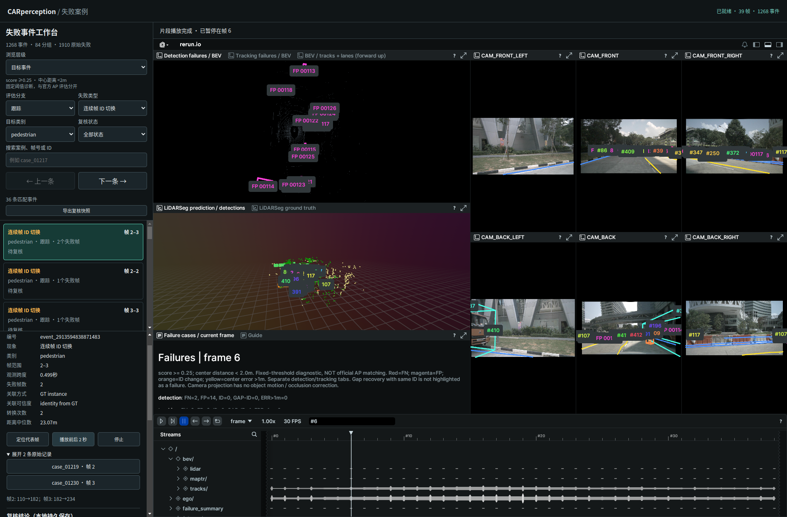

# mini 失败事件与复核工作流

2026-09-29。范围为已有 scene-0061 的 39 帧离线有真值诊断；未重新推理、训练或改写原始评估。线上无真值异常挖掘、场景级因果归因不在本次范围。

## 结果

1910 条有效失败记录归并为 **1268 个目标事件、84 个现象分组**。另有 34 条同 ID gap_recovery 原始记录，按原协议不列为失败。每条有效失败恰好归属一个事件；原始 case_id 保留。

| 类型 | 原始失败记录 | 归并事件 |
|---|---:|---:|
| 漏检 FN | 114 | 97 |
| 误检 FP | 1599 | 1007 |
| 中心误差 >1m | 113 | 87 |
| 连续帧 ID 切换 | 46 | 39 |
| 间隔后换 ID | 38 | 38 |

46 次连续 ID 切换与 38 次间隔后换 ID 的转换记录均保留。事件数下降不代表模型精度提升；FP/FN、官方 mAP/NDS 与原评估一致。

## 归并规则

- 真值事件按 scene/module/kind/class/instance 分组，必须相邻帧且时间差≤0.75秒；恢复或缺帧后另建事件，不把正常间隔算成持续失败。
- FP 使用对应 M05/M11 原始预测，核对 sample、类别、中心位置后读取速度和尺寸。位置和速度转入参考 LiDAR ego pose 对应的全局坐标。
- 前一帧预测中心 + 速度×时间差，与当前帧同类 FP 做一对一 Hungarian；XY 预测残差≤2m，三维尺寸最大比≤2。跟踪 FP 额外要求相同预测 ID。无跨空帧重连。
- FP 是启发式关联，未用真值证明身份，不支持将其解读为真实目标数量。2m 残差门限是本次归并参数，和诊断的2m GT匹配门限是两回事。
- 代表帧优先中心误差最大，其次预测分数最高，再取最早帧；没有上述数值时选择首帧。定位代表帧和播放完整事件是不同操作。
- span_seconds 是首末异常时间戳差，单观测事件为0秒；另保留失败帧数。它不是连续物理失败时长的精确估计。
- 分组维度为模块、失败类型、类别、事件距离中位数桶：[0,20)、[20,40)、[40,+∞)m。分组是现象分类，不是已确认根因；没有曝光量，展示数量而不虚构失败率。
- 原始检测和跟踪诊断分开归并；不把跨模块、时间重叠的异常自动认定为同一因果问题。
- 数据版本由来源案例、事件内容、帧信息和参数生成；稳定事件 ID 取规则与成员列表摘要。重新生成相同数据的结果一致。

## 页面操作

打开 http://127.0.0.1:9092/ ，已有页面需要刷新：

1. 默认“目标事件”；切换“问题分组排行榜”按事件数量查看现象分组，点击“查看组内事件”进入组内。点击“退出分组筛选”回到全部事件。
2. 可按模块、类型、类别、复核状态或编号搜索。组的复核状态独立于成员事件，不会因组已解决就自动把成员标成已解决。
3. 点击事件，记录就绪后定位代表帧；展开原始记录可逐帧核查。旧的 #case_XXXXX 链接仍可打开原始案例，并返回所属事件。
4. “播放前后2秒”按原始采样时间逐帧更新 Viewer，范围裁剪到同一场景；结束自动暂停。停止、新选择或筛选操作取消旧片段。记录未就绪时禁止播放。
5. 在详情下方填写复核状态、负责人、根因/调查记录、改进措施、验证证据；点击保存。详情与列表各自可滚动。
6. “已解决”要求非空验证说明；这只是人工结论，系统不自动证明修复有效。“重复问题”要求另一个有效事件/分组，拒绝循环引用。
7. “重新读取”读取最新复核；发生版本冲突时拒绝覆盖，保留表单供用户决定，再重新读取。
8. “导出复核快照”下载当前数据版本下的全部结论和历史。未点击保存的表单不会自动持久化。

Rerun 的 Detection/Tracking failures 页签仍需手动选择；事件播放同步时间，不自动切换内部页签和视角。当前完整录制首次解析约3分钟；事件浏览与复核可以先操作。

## 存储和版本

- events.json：可分享的事件、分组、frame→时间映射和案例 SHA256。
- summary.json：统计、参数和源文件 SHA256；原始数据、权重、RRD 继续忽略。
- 复核服务保存于 outputs/case_browser/reviews/<dataset_id>.json（本地、Git忽略），带每条 revision 和 UTC 修改时间、历史记录。JSON线程锁、临时文件原子替换；拒绝过期 revision。
- 不同数据版本分文件保存，不将旧结论套到新事件上。复核以本机单用户工具为定位，无账号体系和团队权限管理。
- 本报告和实现上传仓库；未来人工结论可用“导出复核快照”整理进报告，网页每次保存不会触发 Git 推送。本次浏览器 QA 使用明确标识的临时复核并恢复待复核，历史保留作测试审计。

## 复现与代码位置

在仓库根目录执行：

```bash
perception_lab/envs/mmdet3d/bin/python perception_lab/tools/aggregate_failure_events.py
perception_lab/envs/rerun/bin/python perception_lab/tools/start_case_browser.py --stop
perception_lab/envs/rerun/bin/python perception_lab/tools/start_case_browser.py --no-browser
perception_lab/envs/mmdet3d/bin/python -m unittest discover -s perception_lab/tests
node --experimental-modules perception_lab/tests/test_case_browser.mjs
node --experimental-modules perception_lab/tests/test_event_logic.mjs
```

- tools/aggregate_failure_events.py：原始数据校验、坐标变换、归并、分组与产物。
- tools/event_reviews.py：复核校验、乐观并发和原子持久化。
- tools/start_case_browser.py：GET/POST /api/reviews；原有文件服务白名单。
- web/case_browser/event_ui.js：三级浏览、复核表单与导出。
- web/case_browser/event_logic.mjs：片段边界、按时间推进与取消。
- tests/test_failure_events.py、test_event_reviews.py、test_event_review_http.py、test_event_logic.mjs：归并守恒、几何、持久化/冲突和播放边界验证。

## 验证结果

- 46 项 Python 检查通过；包含原有37项、归并7项、复核存储1项、HTTP接口1项。
- JS 筛选/跳帧及片段边界/结束/取消测试通过。
- 实际数据1910条失败一一归属；重新生成 events.json SHA256 不变；原始模型输出与评估文件没有修改。
- 真实 Chrome / WebGL：分组下钻、事件→代表帧2、展开原始记录、片段按预计边界在帧6结束且 playing=false、原始 FN 返回帧0、所属事件、空筛选、窄窗口通过。
- 保存临时复核后整页刷新并重新读取，结论仍在；随后恢复原字段。旧 #case_01217 链接正常打开原始案例；导出下载为有效复核JSON。
- 浏览器 pageerror 为空。初始化测试曾发现未启动 Viewer 时调用暂停接口，修复为只有开始片段后才操作其 recording；最终复测通过。
- Browser plugin not available，使用本机 /usr/bin/python3 的 Playwright 与有界面 /usr/bin/google-chrome。

复现浏览器验证（会临时写入复核，恢复原字段，历史留有QA记录）：

```bash
/usr/bin/python3 perception_lab/tests/browser_event_workflow.py --out /tmp/car-event-check
```

[机器可读验证](verification.json) · [测试日志](tests.log) · [窄窗口截图](narrow.png)



更新：2026-09-29 后续显示优化已将9092切换为异常优先布局，事件分支自动联动视图，正常框按需显示；上述旧版页签与加载时间说明以[显示优化报告](../failure_display/report.md)为准。
