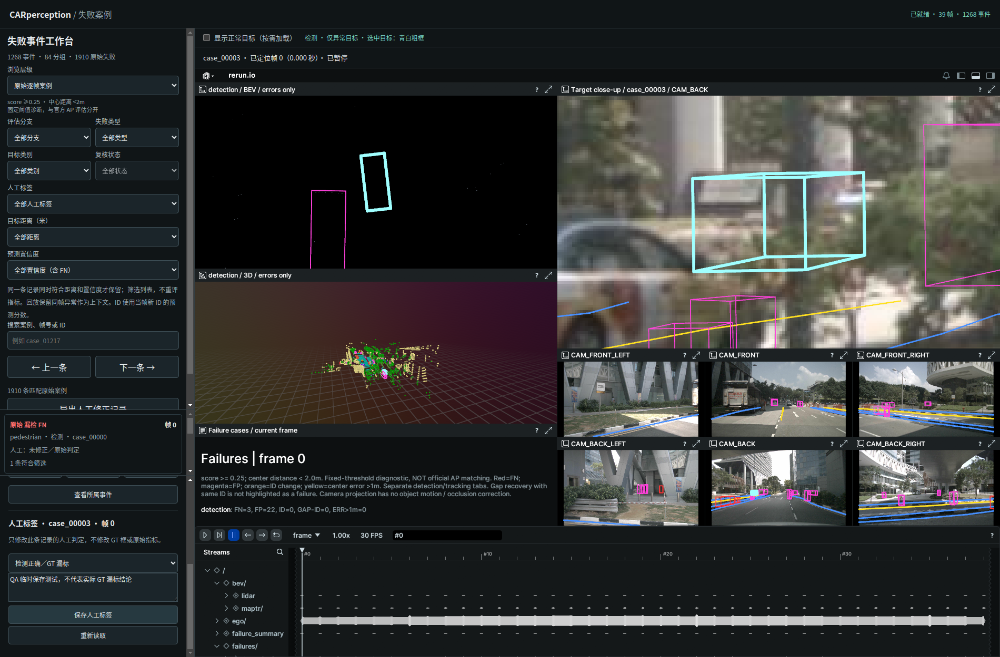

# 人工修正失败案例标签

2026-09-29。适用于 scene-0061 的 39 帧失败工作台。

## 使用

1. 选择事件或原始案例；事件可展开成员，点击需要修改的具体帧。
2. 在详情底部“人工标签 · case 编号 · 帧号”中选择判定，必要时填写可选依据，点击“保存人工标签”。
3. 用左侧“人工标签”筛选查看 GT 漏标等案例；选“未修正／原始判定”可只看尚未人工修正的记录。
4. 选择“未修正／原始判定”并保存可恢复；“重新读取”获取其他窗口的最新修改；“导出人工修正记录”下载 JSON。

标签：检测正确／GT 漏标、检测正确／其他匹配问题、GT 标注错误、确认模型失败、待进一步确认、未修正／原始判定。前两项只允许用于原始 FP，避免把没有预测的 FN 直接标成正确检测。

修改只应用于编辑器标题指定的单条案例，不扩展到整个事件、整个 GT 实例或检测/跟踪另一分支。事件成员切换时，编辑器与高亮同步指向该成员。事件和分组的人工标签筛选也要求同一条成员同时符合置信度、距离和人工标签。

## 原始评估与人工判断

列表明确区分“原始 FP/FN 等诊断”和“人工标签”；人工修正是用户判断，不代表已经核实数据集漏标。Rerun 中的原始异常框颜色、帧摘要及原始指标保留原评估口径。修改后仍可回溯原始 FP。

本功能不添加、删除或拖动 nuScenes GT 3D 框，不调整类别几何，不自动生成新的 TP/FP、AP/NDS 指标。若后续需要正式补标评估，应将人工判定转成经过复核的新 GT 版本，再重新匹配和评估；不能把所有被用户标为正确的 FP 直接从官方统计中减去。

## 持久保存与导出

`tools/case_labels.py` 保存到本地 `outputs/case_browser/labels/<cases_sha256>.json`，包含原始案例副本、人工标签、可选说明、UTC 时间、修订号和历史。输入绑定原始 cases SHA-256，使用锁、fsync 和原子替换；旧修订号返回 409，须重新读取。`start_case_browser.py` 提供 GET/POST `/api/labels`，复用 JSON 长度和来源检查。

人工标签与旧的事件复核记录分开保存。页面刷新保留修改。导出按钮下载完整版本与历史；后续用户操作不会在每次点击时自动 Git 提交。标签文件在本机运行目录，需通过导出保存或分享。代码及本功能验证报告已纳入项目。

## 验证

```bash
perception_lab/envs/mmdet3d/bin/python -m unittest discover -s perception_lab/tests -p 'test_*.py'
/usr/bin/python3 perception_lab/tests/browser_case_labels.py --out /tmp/car_labels_final
/usr/bin/python3 perception_lab/tests/browser_distance_filter.py --out /tmp/car_labels_distance
```

58 项 Python 测试通过，覆盖保存、恢复、历史、版本冲突、无效标签/对象及 FP 限制；新增测试先失败后通过。Browser plugin not available，使用系统 Playwright/Chrome 在 1900×1250 和 700×950 视口验证保存、刷新、筛选、导出、过期版本 409、恢复、FN 禁选及事件内成员切换；无页面异常，距离筛选回归通过。修改前后原始 cases 文件逐字节一致。

截图中的 GT 漏标标签是明确标注为 QA 的临时测试，不是对此目标的正式人工判断。测试后已恢复原始标签和空说明，历史中保留测试与恢复记录；没有提交测试导出的假修正数据。

证据：[浏览器验证](verification.json)、[距离回归](distance_verification.json)、[原始数据与恢复检查](source_check.json)、[测试日志](tests.log)。未验证其他浏览器或多人账号权限；当前是本机工作台。


