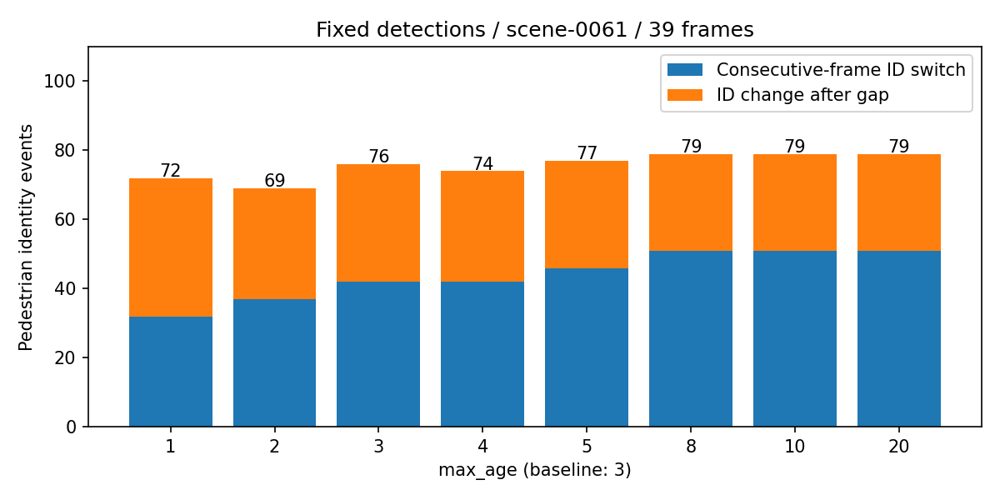

# max_age 对照实验

日期：2026-09-30。结论：在当前 scene-0061 的 39 帧中，将 max_age 从 3 增至 4 仅小幅改善；更大值使行人两类身份错误的合计增加。未修改线上参数或 Rerun 录制。

## 协议与证据

固定同一组真实 CenterPoint 检测、输入顺序、速度、时间戳、贪心关联及行人 1 m 关联门限，仅改变 max_age。评估复用现有代码：score ≥ 0.25，同类别全局 XY 距离 < 2 m；跟踪评估先保留有效的前帧关联，再匹配剩余框。max_age=3 的输出轨迹逐项精确复现已有运行，评估结果也完全一致，见 [校验与输入哈希](verification.json)。

max_age 按未匹配更新次数计，不是秒。新轨迹 age=1；max_age=3 可在连续两次未匹配后保留旧轨迹，第三次仍未匹配则删除。未匹配轨迹不作为当前帧检测输出。本场景约 2 Hz，不应将参数直接解释为固定秒数。

## 行人结果

| max_age | 连续帧 ID 切换 | 间隔后 ID 变化 | 两类合计 | 相对基线减少 | 同 ID 间隔恢复 |
|---|---:|---:|---:|---:|---:|
| 1 | 32 | 40 | 72 | 5.26% | 13 |
| 2 | 37 | 32 | 69 | 9.21% | 21 |
| 3 | 42 | 34 | 76 | 0.00% | 19 |
| 4 | 42 | 32 | 74 | 2.63% | 21 |
| 5 | 46 | 31 | 77 | -1.32% | 22 |
| 8 | 51 | 28 | 79 | -3.95% | 25 |
| 10 | 51 | 28 | 79 | -3.95% | 25 |
| 20 | 51 | 28 | 79 | -3.95% | 25 |

负的“减少”表示错误增加。该合计是本次诊断用的两类事件之和，不是官方 IDSW 或 AMOTA。

- **3 → 4**：行人连续 ID 切换保持 42 次，间隔后换 ID 从 34 降至 32；合计减少 2 次（2.63%）。全类别两类合计从 84 降至 80（4.76%）。
- **3 → 5**：行人间隔后换 ID 减少 3 次，但连续切换增加 4 次，合计 77 次，比基线多 1 次。
- **3 → 8/10/20**：行人间隔后换 ID 减少 6 次，连续切换增加 9 次，合计 79 次，比基线多 3 次。
- 对照中 **max_age=2** 的行人合计最低，为 69 次，比基线少 7 次（9.21%）；全类别合计 77 次，比基线少 7 次（8.33%）。因此当前场景没有支持“应增加 max_age”的证据。
- 各设置的行人 TP/FP/FN 均为 816/397/21；全类别均为 1177/579/39。单独增加 max_age 没有改善本次漏检、误检数量。

## 解释与限制

延长轨迹保留时间可以让部分断开的轨迹重接；它不改善检测位置、速度，也不放宽 1 m 门限。保留更久的旧轨迹同时参与竞争，是更大 max_age 下连续切换增加的合理解释，但本实验没有记录完整关联矩阵，不能将每次增加都归因于具体的抢占行为。

仅一个 mini 场景、39 帧、同一批输入的确定性配对对照；没有独立场景重复，不报告显著性、置信区间或正式验证集性能。相邻帧并非独立样本。最大值 20 也不是全局最优参数搜索。若只比较增大参数，4 是本次最好的候选；包含减小参数的对照时，2 的合计更低。建议将 2/3/4 放到更多场景验证，同时分析关联距离和速度误差；当前默认仍为 3。

## 复现与文件

在项目根目录执行：

```bash
perception_lab/envs/mmdet3d/bin/python perception_lab/reports/max_age_sweep/run.py
```

[原始指标 CSV](metrics.csv)、[逐设置身份事件](identity_events.json)、[复现脚本](run.py)。原始检测与数据需本地已有。



图中分开呈现连续切换和间隔后变化，避免只看下降的一类而误判总体改善。
