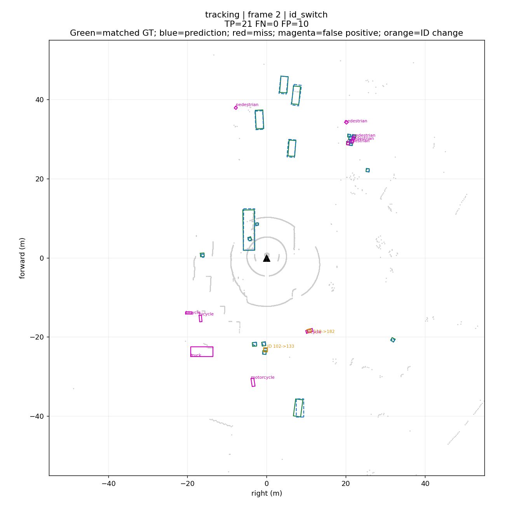
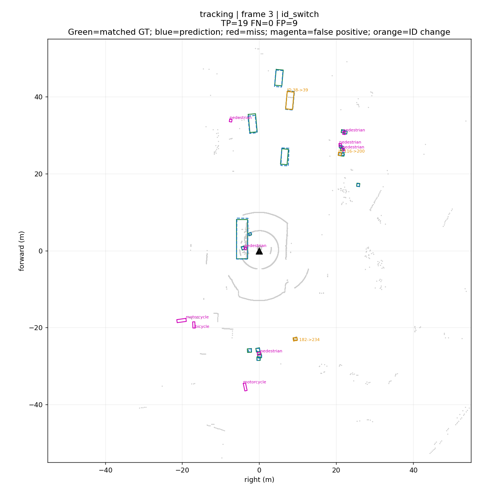
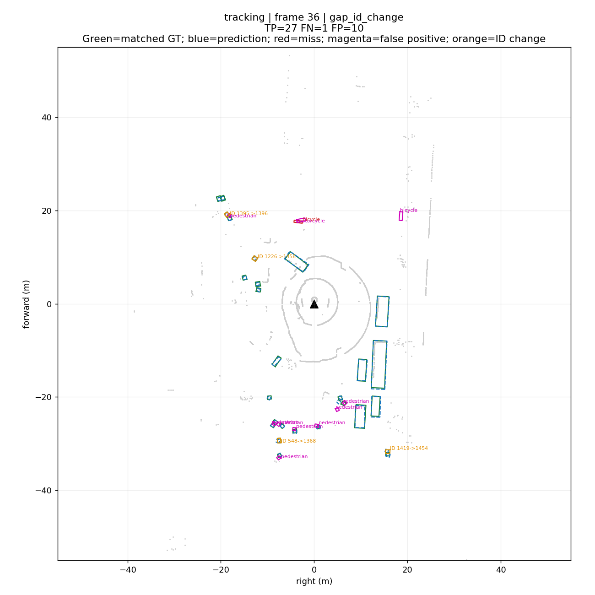
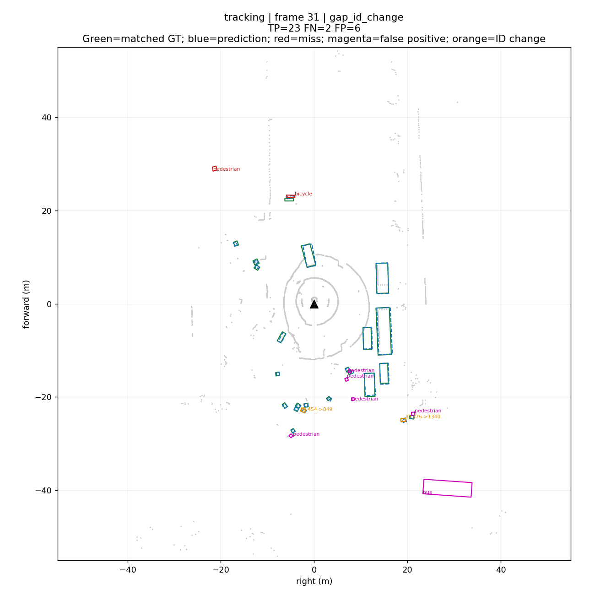
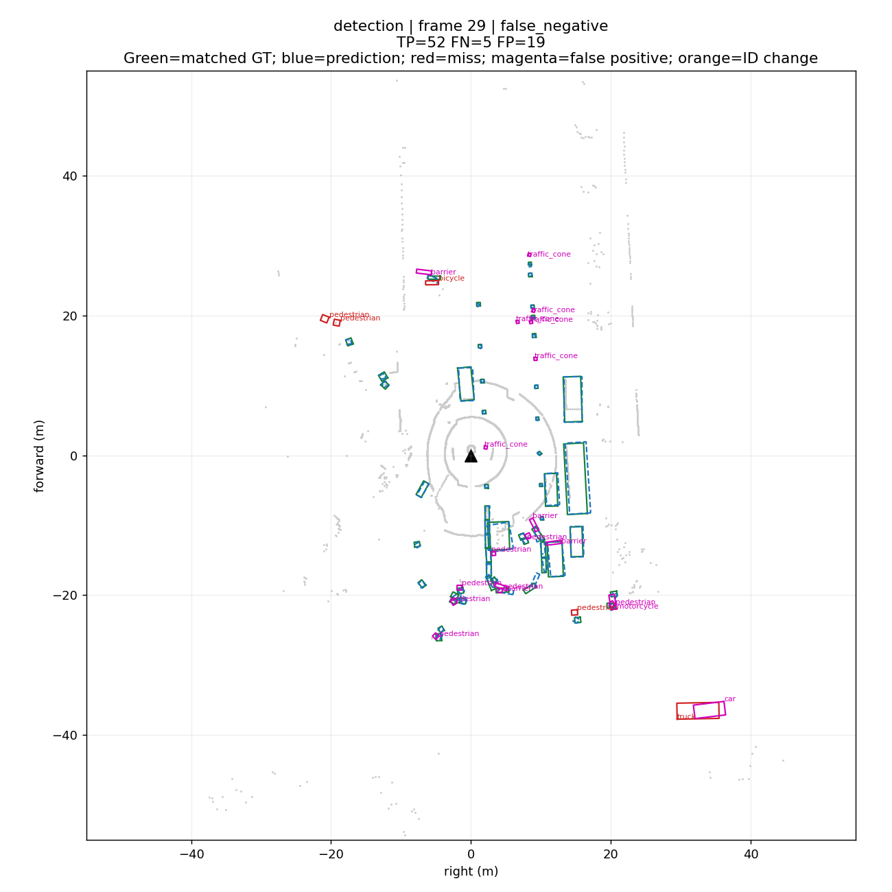
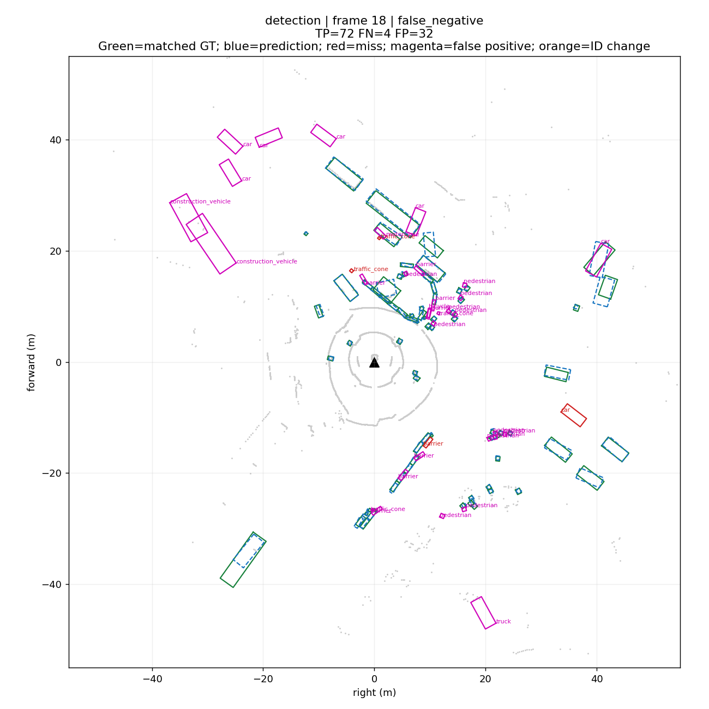
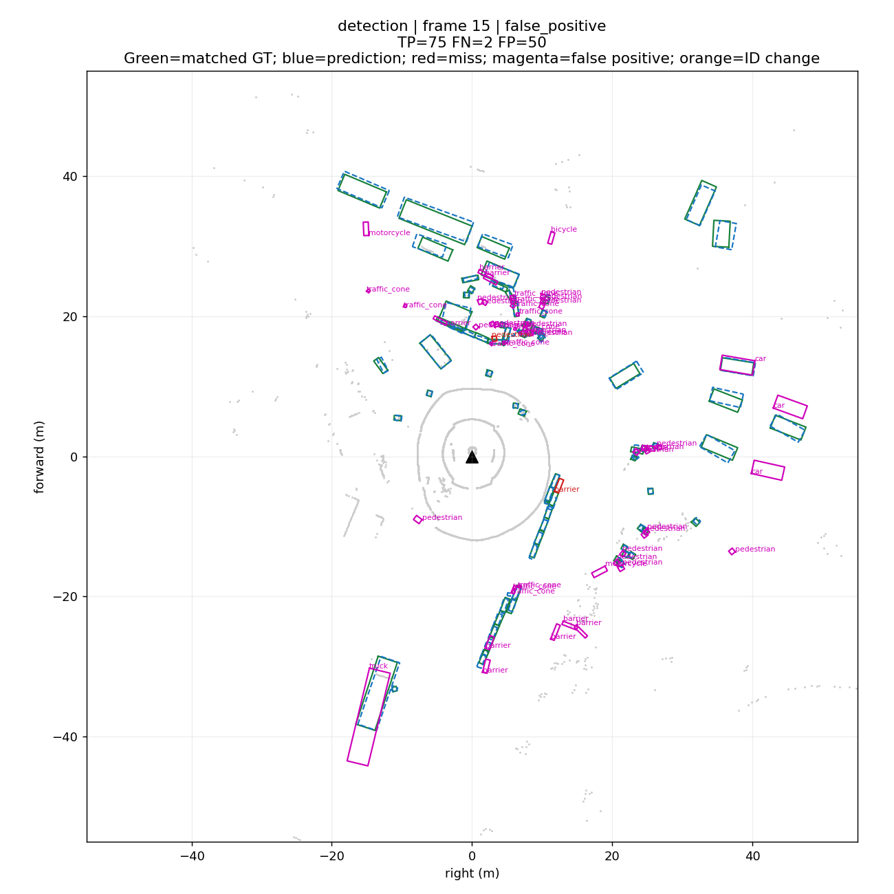
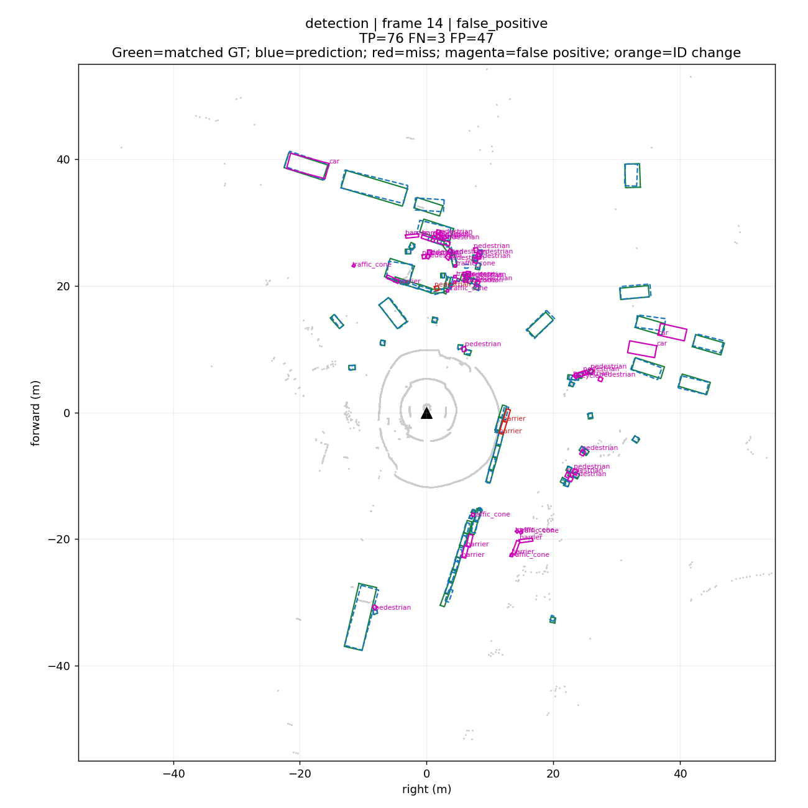
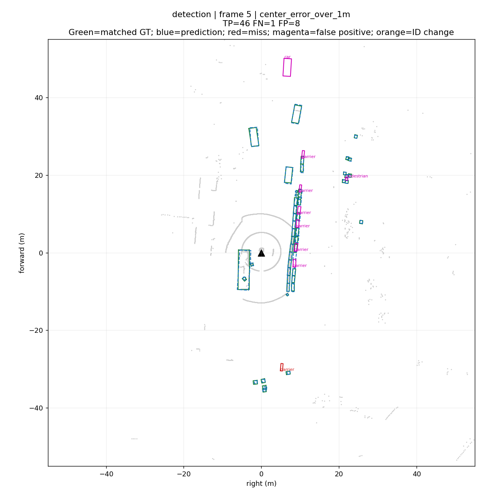
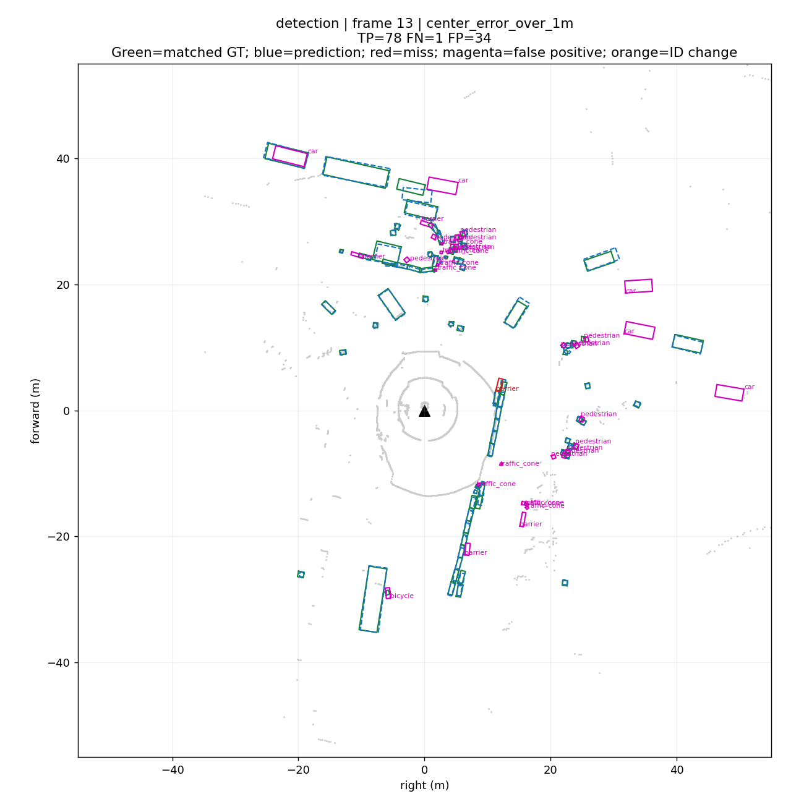

# mini 检测与跟踪诊断

场景 scene-0061，39 帧；score ≥ 0.25，同类别地面中心距离 < 2.0 m。

**仅为固定阈值教学诊断，不是官方 mAP、NDS 或 AMOTA；mini 可能与预训练数据重叠。**

| 分支 | TP | FP | FN | 精确率 | 召回率 | 匹配中心平均误差/m |
|---|---:|---:|---:|---:|---:|---:|
| detection | 2235 | 1020 | 75 | 0.687 | 0.968 | 0.229 |
| tracking | 1177 | 579 | 39 | 0.670 | 0.968 | 0.212 |

## 统计口径

检测含 10 类，跟踪含 7 类；两分支的 TP/FP/FN 不能直接相加。数量为逐帧目标次数，不是独立物体数。
沿用官方类别映射、类别距离范围、零 LiDAR+radar 点真值过滤与自行车架过滤。中心误差仅在成功匹配目标上统计，不衡量尺寸或朝向。
检测按分数从高到低一对一匹配；跟踪优先保留有效的前帧配对，再做门限内匈牙利匹配。阈值或匹配策略改变会影响结果。
id_switch 是连续帧换 ID；gap_id_change 是间隔后换 ID，间隔可能来自漏检、过滤或离开评估范围；gap_recovery 表示同 ID 恢复，不直接认定为失败。
center_error_over_1m 是已匹配目标的额外误差标记，不额外计入 FP/FN。误检、漏检的具体成因需要结合图片人工确认。

## 跟踪身份事件

{"id_switch": 46, "gap_recovery": 34, "gap_id_change": 38}

## 分类结果

| 分支 | 类别 | TP | FP | FN | 精确率 | 召回率 |
|---|---|---:|---:|---:|---:|---:|
| detection | barrier | 664 | 187 | 23 | 0.780 | 0.967 |
| detection | bicycle | 36 | 56 | 7 | 0.391 | 0.837 |
| detection | bus | 0 | 2 | 0 | 0.000 | — |
| detection | car | 191 | 71 | 7 | 0.729 | 0.965 |
| detection | construction_vehicle | 39 | 21 | 4 | 0.650 | 0.907 |
| detection | motorcycle | 29 | 34 | 1 | 0.460 | 0.967 |
| detection | pedestrian | 815 | 398 | 22 | 0.672 | 0.974 |
| detection | traffic_cone | 356 | 232 | 8 | 0.605 | 0.978 |
| detection | trailer | 0 | 2 | 0 | 0.000 | — |
| detection | truck | 105 | 17 | 3 | 0.861 | 0.972 |
| tracking | bicycle | 36 | 56 | 7 | 0.391 | 0.837 |
| tracking | bus | 0 | 2 | 0 | 0.000 | — |
| tracking | car | 191 | 71 | 7 | 0.729 | 0.965 |
| tracking | motorcycle | 29 | 34 | 1 | 0.460 | 0.967 |
| tracking | pedestrian | 816 | 397 | 21 | 0.673 | 0.975 |
| tracking | trailer | 0 | 2 | 0 | 0.000 | — |
| tracking | truck | 105 | 17 | 3 | 0.861 | 0.972 |

## 分数阈值对比（同一场景，不用于选择泛化最优阈值）

| 分支 | score | 精确率 | 召回率 | FP | FN |
|---|---:|---:|---:|---:|---:|
| detection | 0.1 | 0.428 | 0.985 | 3042 | 34 |
| tracking | 0.1 | 0.370 | 0.987 | 2045 | 16 |
| detection | 0.25 | 0.687 | 0.968 | 1020 | 75 |
| tracking | 0.25 | 0.670 | 0.968 | 579 | 39 |
| detection | 0.5 | 0.920 | 0.861 | 173 | 320 |
| tracking | 0.5 | 0.918 | 0.851 | 92 | 181 |

## 失败统计摘要

| 分支 | 事件 | 类别 | 次数 |
|---|---|---|---:|
| detection | center_error_over_1m | barrier | 19 |
| detection | center_error_over_1m | bicycle | 1 |
| detection | center_error_over_1m | car | 3 |
| detection | center_error_over_1m | construction_vehicle | 2 |
| detection | center_error_over_1m | pedestrian | 32 |
| detection | center_error_over_1m | traffic_cone | 21 |
| detection | center_error_over_1m | truck | 2 |
| detection | false_negative | barrier | 23 |
| detection | false_negative | bicycle | 7 |
| detection | false_negative | car | 7 |
| detection | false_negative | construction_vehicle | 4 |
| detection | false_negative | motorcycle | 1 |
| detection | false_negative | pedestrian | 22 |
| detection | false_negative | traffic_cone | 8 |
| detection | false_negative | truck | 3 |
| detection | false_positive | barrier | 187 |
| detection | false_positive | bicycle | 56 |
| detection | false_positive | bus | 2 |
| detection | false_positive | car | 71 |
| detection | false_positive | construction_vehicle | 21 |
| detection | false_positive | motorcycle | 34 |
| detection | false_positive | pedestrian | 398 |
| detection | false_positive | traffic_cone | 232 |
| detection | false_positive | trailer | 2 |
| detection | false_positive | truck | 17 |
| tracking | center_error_over_1m | bicycle | 1 |
| tracking | center_error_over_1m | car | 3 |
| tracking | center_error_over_1m | pedestrian | 27 |
| tracking | center_error_over_1m | truck | 2 |
| tracking | false_negative | bicycle | 7 |
| tracking | false_negative | car | 7 |
| tracking | false_negative | motorcycle | 1 |
| tracking | false_negative | pedestrian | 21 |
| tracking | false_negative | truck | 3 |
| tracking | false_positive | bicycle | 56 |
| tracking | false_positive | bus | 2 |
| tracking | false_positive | car | 71 |
| tracking | false_positive | motorcycle | 34 |
| tracking | false_positive | pedestrian | 397 |
| tracking | false_positive | trailer | 2 |
| tracking | false_positive | truck | 17 |
| tracking | gap_id_change | bicycle | 2 |
| tracking | gap_id_change | car | 1 |
| tracking | gap_id_change | pedestrian | 34 |
| tracking | gap_id_change | truck | 1 |
| tracking | gap_recovery | bicycle | 2 |
| tracking | gap_recovery | car | 11 |
| tracking | gap_recovery | pedestrian | 19 |
| tracking | gap_recovery | truck | 2 |
| tracking | id_switch | bicycle | 2 |
| tracking | id_switch | car | 1 |
| tracking | id_switch | pedestrian | 42 |
| tracking | id_switch | truck | 1 |

## 失败案例入口

[本地图片画廊](index.html) · [逐帧统计](frames.csv) · [完整案例清单](cases.csv) · [来源哈希与口径](summary.json)

frame 从 0 开始，与 Rerun 的 frame 时间轴一致；sample_token 可精确定位原数据。以下图片选择错误较多帧及身份变化帧，不代表随机样本。

### tracking / frame 2 / id_switch

sample_token: `356d81f38dd9473ba590f39e266f54e5`



### tracking / frame 3 / id_switch

sample_token: `e0845f5322254dafadbbed75aaa07969`



### tracking / frame 36 / gap_id_change

sample_token: `67e5f88901214f3aa03d68e028185e22`



### tracking / frame 31 / gap_id_change

sample_token: `5fda58ee3ae44ab9b4bbac7a2de66c27`



### detection / frame 29 / false_negative

sample_token: `378a3a3e9af346308ab9dff8ced46d9c`



### detection / frame 18 / false_negative

sample_token: `bf2938e43c6f487497cda76b51bfc406`



### detection / frame 15 / false_positive

sample_token: `cd21dbfc3bd749c7b10a5c42562e0c42`



### detection / frame 14 / false_positive

sample_token: `2afb9d32310e4546a71cbe432911eca2`



### detection / frame 5 / center_error_over_1m

sample_token: `f1e3d9d08f044c439ce86a2d6fcca57b`



### detection / frame 13 / center_error_over_1m

sample_token: `1e3d79dae62742a0ad64c91679863358`



## 复现

```bash
cd perception_lab
envs/mmdet3d/bin/python tools/evaluate_mini.py --score 0.25 --distance 2.0
```

过滤规则参考：[nuScenes detection](https://github.com/nutonomy/nuscenes-devkit/blob/master/python-sdk/nuscenes/eval/detection/README.md)。本脚本未运行官方整套评估。
