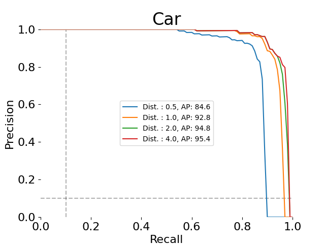

# 官方评估代码计算的 mini 单场景诊断

执行日期：2026-09-28。对象仅为 M05 CenterPoint，nuScenes `v1.0-mini / scene-0061`，自定义 split `mini_scene_0061`，完整 **39 帧**。复用实测预测，未重跑 GPU，未修改 M11 或原固定阈值诊断。

## 实测结果

| 指标 | 数值 |
|---|---:|
| mAP | 0.699071191 |
| NDS | 0.610700323 |
| mATE / m | 0.330169017 |
| mASE | 0.348427731 |
| mAOE / rad | 0.369457389 |
| mAVE / m/s | 0.340298585 |
| mAAE | 1.000000000 |

这是**官方代码计算的 mini 单场景诊断，不是 nuScenes 官方 val 榜单成绩**。scene-0061 属于训练场景，可能与预训练数据重叠。
过滤后 bus、trailer 无真值，官方代码将其 AP 置为 0，相关 TP 误差采用默认 1，仍参与均值；不能用此场景推断这些类别的检测能力。没有自行剔除类别或更改官方均值。
模型没有输出属性，因此全部 `attribute_name=""`，未从 GT 推断或填写。mAAE=1.0、属性得分=0，影响 NDS；这是保留空属性时的结果，不代表带属性估计的完整提交能力。官方 JSON 对不适用的 TP 项保留 NaN（例如交通锥朝向），未改写官方输出。

## 三种评估范围

| 范围 | 方法 | 结果 |
|---|---|---|
| 原 mini 单点诊断 | score≥0.25、2m，项目诊断匹配 | 检测 P=0.686636，R=0.967532；[原报告](../mini_evaluation/report.md)保持不变 |
| 本次 mini 官方代码 | devkit 1.2.0 / detection_cvpr_2019，四距离、PR/AP | mAP=0.699071，NDS=0.610700 |
| 完整官方 val | v1.0-trainval / val | **blocked_full_val**：缺完整数据与覆盖全 val 的实测预测 |

## 每类四距离 AP

| 类别 | 0.5m | 1m | 2m | 4m | 平均 |
|---|---:|---:|---:|---:|---:|
| car | 0.846148 | 0.928012 | 0.948463 | 0.954486 | 0.919277 |
| truck | 0.876010 | 0.954026 | 0.978277 | 0.978277 | 0.946647 |
| bus | 0.000000 | 0.000000 | 0.000000 | 0.000000 | 0.000000 |
| trailer | 0.000000 | 0.000000 | 0.000000 | 0.000000 | 0.000000 |
| construction_vehicle | 0.814468 | 0.839673 | 0.888337 | 0.904680 | 0.861790 |
| pedestrian | 0.898772 | 0.922231 | 0.933486 | 0.944449 | 0.924735 |
| motorcycle | 0.885964 | 0.885964 | 0.885964 | 0.885964 | 0.885964 |
| bicycle | 0.543123 | 0.661777 | 0.689591 | 0.694681 | 0.647293 |
| traffic_cone | 0.865560 | 0.874500 | 0.897272 | 0.905070 | 0.885601 |
| barrier | 0.807771 | 0.944996 | 0.956975 | 0.967882 | 0.919406 |



PNG 由官方 `class_pr_curve` 读取本次 metrics_details/summary 生成；[官方 CLI 的全部 PDF 曲线](metrics/plots/)和 [5 张官方示例](metrics/examples/)一并保留。

## 数据、模型和导出核验

- 原始实测文件：`runs/20260923T043110_d6ae8066/M05/mini_scene/predictions.json`，由 results/status.json 的 M05.mini_scene 定位；既有产物哈希校验通过。
- 39 个唯一 token 与 scene 元数据及官方自定义 split 完全一致。输入 8,399 框，导出 8,399 框，最多 277 框/帧，无 top-500 截断；分数范围 [0.10000041872262955, 0.9300923347473145]。原模型真实空列表会保留，不为缺失帧补造预测。
- 原推理配置：score_threshold=0.1，circle NMS，min_radius=[4,12,10,1,0.85,0.175]，post_max_size=83，pre_max_size=1000。其余范围限制见 [解析后模型配置](resolved_model_config.py)。导出未施加新的 score≥0.25 截断，无法恢复推理阶段已过滤的候选。
- 官方过滤后预测 5,318 框、真值 2,310 框。官方类别范围、0.5/1/2/4m、min_recall/min_precision=0.1、max_boxes=500 配置均未修改。
- 输入是已标准化的 ego gravity-centre，使用每个 sample 的 LIDAR_TOP ego_pose 转为 global；尺寸保持 w,l,h；不重复加半框高。速度由真实 ego xy 以 z=0 提升旋转后取 global xy，不用 GT 生成速度或属性。原适配器只保留 ego xy，不能恢复已经丢弃的垂直速度分量。
- 每帧首个真实框共 39 框验证中心、提升后的三维速度和姿态矩阵往返，最大绝对误差：{'center': 1.2789769243681803e-13, 'velocity': 7.993605777301127e-15, 'rotation': 6.661338147750939e-16}。全量验证有限数值、正尺寸、单位四元数、类别、分数与上限。
- meta 如实标记仅 LiDAR 输入；export 不读取 GT 框。
- checkpoint SHA256：`9061688e5f81adae87d28241143e2d33075f68908134264f0de8c901acf911d8`；config SHA256：`5e198428f9ec1509bc7f9f5d8462b4f01e22255377f44ff34fc04bca65f26e8a`。权重下载地址见 [输入核验](input_audit.json)。
- 预测输入 SHA256：`43be7f1f42b1f77a16440ba99462ea789a30adcfa35fac1f221cdbe1ca126f56`；官方格式输出 SHA256：`2e3944c4201d1a55a79ed797e86e7d81bf3f896d5404b540b48bdc162fec99a7`。导出大文件留在本机 `/home/minglei/Desktop/CAR/perception_lab/runs/20260923T043110_d6ae8066/M05/mini_scene/nuscenes_detection.json`，通过下面命令重新生成。

## 环境、真实命令与复现

原 mmdet3d 环境 devkit=1.1.11 不支持自定义 split；新建独立 Python 3.10.13 环境 `envs/nuscenes_eval`，安装 PyPI 官方 `nuscenes-devkit==1.2.0`，未修改旧推理环境。130 个官方 Python 源文件均与安装 wheel 的 RECORD 哈希一致；关键源码哈希见 verification.json。
```bash
cd perception_lab
/home/minglei/anaconda3/envs/autolabel/bin/python -m venv envs/nuscenes_eval
envs/nuscenes_eval/bin/pip install --index-url https://pypi.org/simple 'nuscenes-devkit==1.2.0' 'opencv-python-headless==4.11.0.86'
bash reports/official_detection_mini/commands.sh
envs/nuscenes_eval/bin/python tools/verify_official_detection.py
```

首次安装曾因系统 Python 3.8 与依赖解析不兼容而重建为 Python 3.10；固定 OpenCV 4.11 避免解析器反复下载不兼容版本。最终完整包版本见 [环境冻结文件](../../envs/nuscenes_eval_freeze.txt)。
实际评估命令（由 commands.sh 执行）：
```bash
envs/nuscenes_eval/bin/python -m nuscenes.eval.detection.evaluate \
  runs/20260923T043110_d6ae8066/M05/mini_scene/nuscenes_detection.json \
  --eval_set mini_scene_0061 --version v1.0-mini --dataroot data/nuscenes \
  --output_dir reports/official_detection_mini/metrics --plot_examples 5 --render_curves 1
```

导出工具会安全合并 data/nuscenes/v1.0-mini/splits.json；遇到已有同名但定义不同的 split 会拒绝覆盖。官方 val 可复用工具并改为 --version v1.0-trainval --eval-set val（不传 --scene），必须先提供完整实测预测；输出到独立 official_detection_val 目录。

## 验收与证据

35 项测试通过；重新读取官方 summary/details，40 个类别×距离 AP 使用官方 calc_ap 复核一致；101 点 PR 数组、配置、39 帧覆盖及输入/输出哈希通过。
[metrics_summary.json](metrics/metrics_summary.json) · [metrics_details.json](metrics/metrics_details.json) · [四距离 CSV](class_distance_ap.csv) · [执行脚本](commands.sh) · [评估日志](evaluation.log) · [导出日志](export.log) · [导出核验](export_audit.json) · [验收](verification.json) · [数据元数据哈希](data_metadata_sha256.json) · [全 val 缺失项](full_val_status.json)

执行基线提交：`f33e976704d745ceaf3c559022284c02d50a417d`。本次发布提交另见下方发布记录。

官方资料：[评估代码](https://github.com/nutonomy/nuscenes-devkit/blob/master/python-sdk/nuscenes/eval/detection/evaluate.py)、[检测协议](https://github.com/nutonomy/nuscenes-devkit/blob/master/python-sdk/nuscenes/eval/detection/README.md)。实际执行源码以锁定 wheel 及校验哈希为准。

发布日志仅规范化进度条换行和行尾空白，未改动数值；官方 metrics JSON 原样保存。
