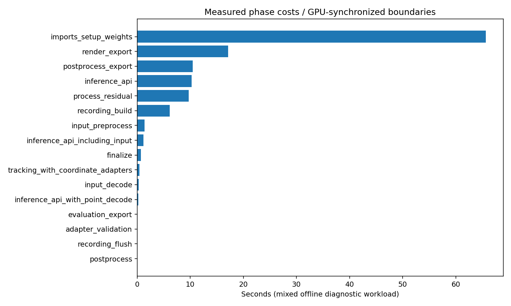

# 全感知离线流程耗时剖析

日期：2026-09-30。实际运行全部13个测量任务，均成功退出。任务进程总耗时 **123.48秒**；控制脚本测得总墙钟 **123.49秒**。

## 口径：当前没有单一实时流水线

项目由独立进程/环境运行各模块，PointPillars/CenterPoint逐帧加载模型，相机脚本保存图片和数组，跟踪脚本包含一致性复跑及MP4输出，Rerun是另一个离线导出步骤。因此本报告区分真实离线任务总成本和模块推理API成本，不将归一化之和称为实测端到端延迟或FPS。

本轮GPU推理实测：前3个时刻，YOLO、米制深度、SegFormer各18张相机图；PointPillars、CenterPoint各3个独立进程；MapTR、Cylinder3D各3帧。跟踪和Rerun导出使用现有39帧结果单独测量：它们不是本轮所有推理结果串接的输出。全部模块联合启用属于教学工作量，PointPillars与CenterPoint是替代性3D检测方案，不意味着部署时必须双跑。

本轮视觉模块设备显式设置CUDA，与早期CPU smoke日志不同；没有用历史耗时凑数。数据/infos/权重已在本地，模型进程新启动，文件系统缓存未清空。没有浏览器前端渲染、网络传输、模型训练或官方评估计时。

## 实际离线任务时间占比

下表分母是本次混合测量工作量的全部进程墙钟时间，样本数不同，不能据此比较单帧性能。

| 模块 | 任务范围 | 实测秒数 | 总任务占比 |
|---|---|---:|---:|
| yolo | 18图/3时刻 | 3.127 | 2.5% |
| depth | 18图/3时刻 | 6.817 | 5.5% |
| segformer | 18图/3时刻 | 11.035 | 8.9% |
| pointpillars | 3帧、逐帧加载 | 29.555 | 23.9% |
| centerpoint | 3帧、逐帧加载 | 35.829 | 29.0% |
| maptr | 3帧/18图 | 8.061 | 6.5% |
| lidarseg | 3帧 | 4.326 | 3.5% |
| tracking_39 | 39帧、复跑+视频 | 17.784 | 14.4% |
| rerun_export_39 | 39帧记录导出 | 6.950 | 5.6% |

## 各阶段总占比（相同混合工作量）

| 阶段 | 秒数 | 占比 |
|---|---:|---:|
| 导入、元数据、模型加载 | 65.687 | 53.2% |
| 离线图像/视频绘制输出 | 17.117 | 13.9% |
| 后处理、校验与文件输出 | 10.464 | 8.5% |
| 推理API（含内部预/后处理） | 10.243 | 8.3% |
| 解释器启动/退出等剩余开销 | 9.696 | 7.9% |
| Rerun记录构建 | 6.097 | 4.9% |
| 输入读取与预处理/H2D | 1.360 | 1.1% |
| 分割API（含读图/预后处理） | 1.197 | 1.0% |
| 汇总、校验与收尾 | 0.666 | 0.5% |
| 跟踪及坐标适配（含复跑） | 0.407 | 0.3% |
| 图像读取/解码 | 0.282 | 0.2% |
| LiDAR分割推理及点解码/D2H | 0.222 | 0.2% |
| 诊断评估与结果输出 | 0.032 | 0.0% |
| 适配、校验/哈希 | 0.009 | 0.0% |
| Rerun刷新写盘 | 0.003 | 0.0% |
| 结果适配 | 0.002 | 0.0% |

## 推理API：按一个传感器时刻归一化

一个时刻包含六路图像与一帧LiDAR。下表把相机的18张调用总时间除以3，其他推理按3帧计算。GPU在计时边界同步；不是仅测CUDA任务提交时间。

| 模块 | 推理API ms/时刻 | 说明 |
|---|---:|---|
| yolo | 343.48 | 含第一次调用；非纯稳态benchmark |
| depth | 618.67 | 含第一次调用；非纯稳态benchmark |
| segformer | 399.02 | 含第一次调用；非纯稳态benchmark |
| pointpillars | 304.19 | 逐帧进程首次推理，含冷启动效应 |
| centerpoint | 2026.17 | 逐帧进程首次推理，含冷启动效应 |
| maptr | 121.88 | 含第一次调用；非纯稳态benchmark |
| lidarseg | 74.08 | 含第一次调用；非纯稳态benchmark |

## 去除首次调用后的API参考值

| 模块 | API ms/次 | 六相机/单LiDAR时刻归一化 ms | 样本次数 |
|---|---:|---:|---:|
| yolo | 4.51 | 27.05 | 17 |
| depth | 85.19 | 511.15 | 17 |
| segformer | 54.22 | 325.30 | 17 |
| maptr | 42.40 | 42.40 | 2 |
| lidarseg | 38.88 | 38.88 | 2 |
| centerpoint | 25.22 | 25.22 | 20 |
| pointpillars | 23.81 | 23.81 | 20 |

相机模块取后17次，MapTR/LiDARseg仅后2次真实输入；CenterPoint/PointPillars另行预热3次、同一首帧重复20次。样本/缓存条件不同，属于排除首次开销后的诊断参考，不是完整稳态多场景基准。常驻探针不计入上面的主任务占比；它们的执行记录见resident_jobs.json。

这些API并非裸网络forward：YOLO含预处理/NMS；SegFormer含读图、滑窗和输出恢复；Depth含图像预处理/缩放恢复；3D test_step含数据预处理、voxelization与解码/NMS；Cylinder3D本段含softmax、逐点取值及CPU传回。因此不能进一步把本表解释为各网络纯GPU算子速度。

## 建议优化顺序

1. **先把3D模型改为进程内加载一次、连续推理**：现有逐帧脚本将导入和权重加载反复计入；这是架构开销，通常不需要修改网络算子即可去除。
2. **将图片绘制、压缩保存、视频编码和证据哈希移出感知关键路径**：它们是当前教学导出的一部分，不能归咎于模型推理慢。
3. **再针对占时较多的推理API做内部profiler**：分别观察预处理、H2D、网络、解码/NMS、D2H；在本报告可分辨的边界内，按实测较大项优先，不凭模型名称排序。
4. **跟踪优化收益单列**：上一轮同输入精确一致的CPU跟踪平均0.77ms/帧；此处原track_mini还包括坐标变换、复跑、画图和视频，不能拿整个脚本时间与0.77ms直接比较。
5. **Rerun导出与页面渲染分开**：本轮测到的是记录构建和写盘，浏览器交互/渲染延迟仍需单独测量。

## 复现与证据

```bash
python3 perception_lab/tools/profile_perception_pipeline.py
python3 perception_lab/tools/profile_perception_pipeline.py --resident-probes
perception_lab/envs/mmdet3d/bin/python perception_lab/reports/pipeline_timing/build_report.py
```

脚本按原入口源码的固定锚点注入互斥阶段边界，运行时显式同步已初始化CUDA；不改模型、配置、输出算法或正式结果。完整调用、退出码和源码哈希见[jobs.json](jobs.json)，逐任务阶段见`*_phases.json`，汇总见[phases.csv](phases.csv)，日志见同目录`.log`。原始模型输出只保存在`outputs/pipeline_timing`及隔离的`runs/pipeline_timing`，不覆盖现有回放。

阶段之和与进程墙钟的剩余差作为解释器等开销单列。重复同步可能影响原本的CPU/GPU重叠，所以这些是同步诊断耗时；本轮没有CPU/GPU流水并发。样本较少，不报告稳定P95或生产吞吐量。


