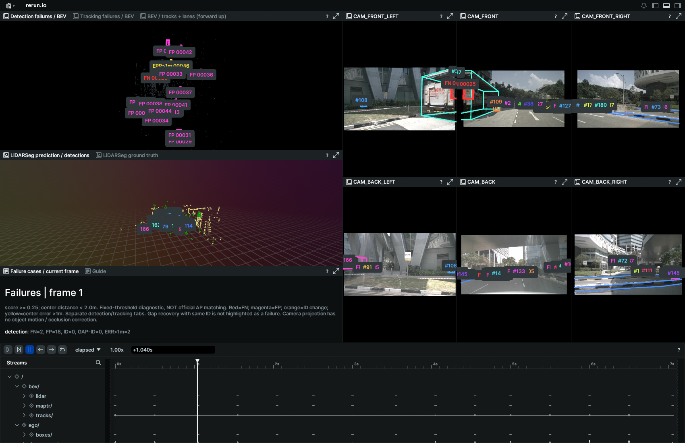
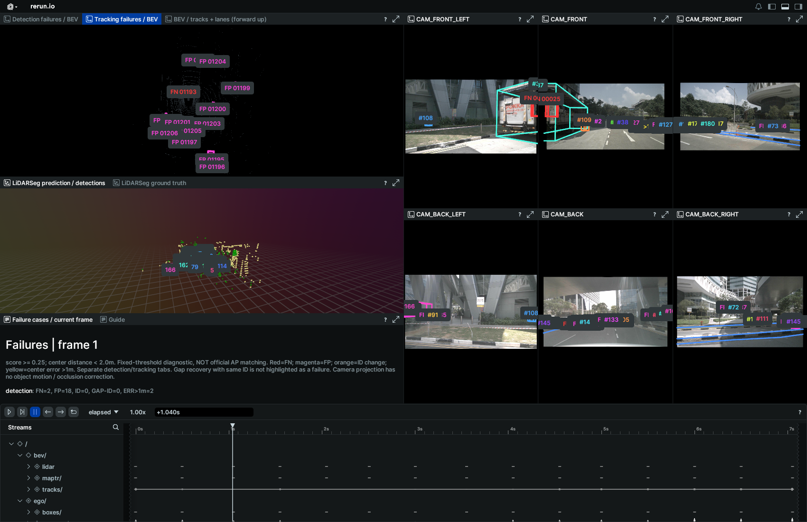

# Rerun 失败案例回放

2026-09-28。使用已有 `reports/mini_evaluation/cases.json`，不重新推理、不改变评估结果。失败标签采用原 **score≥0.25、同类别中心距离<2m** 的固定阈值诊断，不是官方 AP 评估器四距离匹配的可视化。

## 查看

启动 `envs/rerun/bin/python tools/start_rerun.py`，刷新本机查看器：

http://127.0.0.1:9090/?url=http%3A%2F%2F127.0.0.1%3A9091%2Fmini_scene.rrd&renderer=webgl

- 左上 **Detection failures / BEV**：红色 FN 为漏检真值框，紫色 FP 为误检预测框，黄色 ERR>1m 为已匹配但中心偏差超过 1 米的真值位置。
- **Tracking failures / BEV**：独立显示跟踪分支 FN/FP，橙色 ID 标注连续帧换 ID，GAP-ID 标注间隔后换 ID，文字显示旧 ID→新 ID。
- **BEV / tracks + lanes** 保留原来的轨迹、语义点云和车道线显示。
- 右侧六相机叠加检测分支的失败框，路径 `image/failures`；相机与 BEV 使用同一色标。相机投影未补偿动态目标曝光时间差，也不判断遮挡。
- 左下 **Failure cases / current frame** 随时间轴更新本帧各类事件数量和案例清单。编号对应 cases.csv 中 `case_XXXXX`；标签省略 `case_` 前缀。frame 从 0 开始。
- 可定位 frame 2/3 查看 ID 切换、frame 29 查看漏检、frame 15 查看误检。密集标签可放大视图或通过 Blueprint 隐藏其他叠加层。

检测和跟踪是不同评估分支，事件数量不能相加。`gap_recovery` 表示同 ID 恢复，不作为失败高亮。中心误差事件不额外计入 FP/FN。

## 复现

从 perception_lab 目录执行：

```bash
envs/rerun/bin/python tools/rerun_mini.py --out outputs/rerun/mini_scene.rrd
envs/rerun/bin/python tools/start_rerun.py
```

导出器默认读取 `reports/mini_evaluation`；可通过 `--failure-report PATH` 指向相同结构的报告。检查来源哈希、案例计数、frame/token、原始框索引、类别和中心坐标；不匹配时拒绝导出。`--score` 必须与案例报告一致；不加载失败图层时使用 `--no-failures`。

代码：[failure_overlay.py](../../tools/failure_overlay.py)、[rerun_mini.py](../../tools/rerun_mini.py)。运行时每帧递归清理失败图层，避免旧案例残留。

## 验证

37 项测试通过；39 帧 RRD 格式校验通过。显示统计与报告一致：检测 FN=75、FP=1020；跟踪连续 ID 切换=46、间隔后换 ID=38。界面使用本机有图形环境的 Chrome 检查，截图与核验摘要随报告保存。记录文件较大，留在本地 outputs/rerun/，按上述命令生成。

## 页面验证截图





Chrome 1700×1100 检查：暂停、定位早期帧、切换失败页签后画面与案例统计同步，无页面异常。密集标签仍可能重叠，需放大视图或隐藏其他图层。
