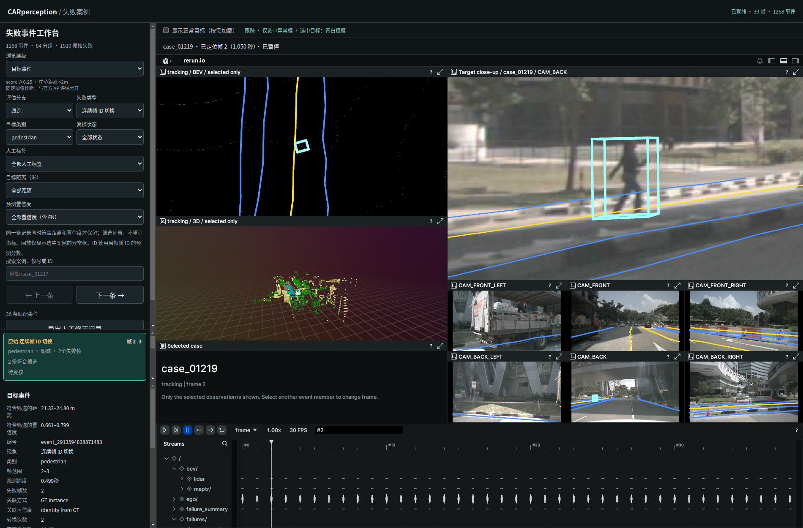

# 只加载和显示选中异常框

2026-09-29。scene-0061，39 帧。

主录制只携带相机图像、点云、车道线等背景及诊断摘要，不再预装所有异常框。选中案例时沿用按需接口，加载当前案例的一组几何及布局。BEV、3D、目标特写和六路相机视图仅包含当前选中框的路径，不包含其他异常框。选中状态的文本面板也只展示当前案例。

正常目标继续由“显示正常目标”开关控制；开启后显示选中异常与正常目标，仍不显示其他异常。无具体选择时只显示背景；切换案例隐藏旧框。异常列表、人工标签及原始评估数据保持原样。

事件默认定位符合筛选条件的代表记录；展开事件点击其他成员时，加载对应帧的框。目前按逐帧案例显示，不自动在片段播放中追随事件的每一帧；离开该记录帧后框清除，也不会展示其他事件。FN 与身份等案例沿用已有 GT 诊断框口径，FP 用预测框。

已在本地重新导出主录制及配套文件，刷新 9092 页面即可加载新版本。以前点击过的目标可保留在浏览器缓存中，但视图只包含当前选择，不同时显示。

## 实现与复现

- `failure_overlay.py` 的 triage 模式只输出背景和计数，继续导出按需选中框所需几何。
- `triage_views.py` 移除全部异常的通配路径，保留指定 case_id 路径、背景和可选正常目标。
- `selection_blueprint.py` 为选中框附加当前案例摘要；下一帧清除。
- 页面说明和状态文字更新为“仅选中异常框”。

```bash
perception_lab/envs/rerun/bin/python perception_lab/tools/rerun_mini.py --triage-only
python3 perception_lab/reports/selected_only/audit.py
perception_lab/envs/mmdet3d/bin/python -m unittest discover -s perception_lab/tests -p 'test_*.py'
/usr/bin/python3 perception_lab/tests/browser_selection.py --out /tmp/car_selected_only
```

## 验证

58 项 Python 测试通过；视图排除其他异常路径的回归先失败后通过。实际 RRD 解码审计确认主录制没有各失败类型的几何实体及 Boxes3D 组件，保留 BEV 点云背景，来源哈希见 [audit.json](audit.json)。

Browser plugin not available，使用系统 Playwright/Chrome，在 1900×1250 与 700×950 验证。页面无异常，案例/事件成员切换、正常目标开关、快速切换、空结果清除、FN 定位及播放清除均通过，主场景仅加载一次。查看截图确认其他异常框消失，当前框、车道线、点云与图像正常。

证据：[交互验证](verification.json)、[测试日志](tests.log)、[导出日志](export.log)。未验证其他浏览器，不涉及重算模型指标。此报告取代此前“回放保留同帧其他异常作为上下文”的显示说明。


