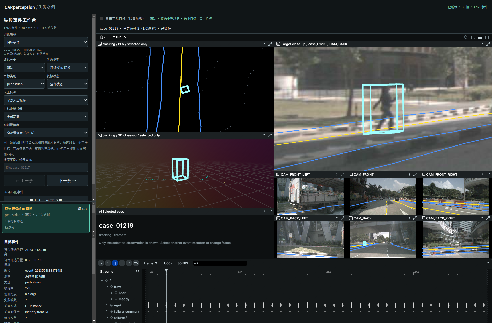

# 选中目标的 3D 联动缩放

2026-09-29，scene-0061 的 39 帧工作台，Rerun 0.23.4。

选中事件或逐帧案例后，3D 视图只使用目标框与附近点云自动取景；因此视角随目标位置和尺寸拉近，不再被整片场景的点云范围拉远。切换事件内成员会重新加载其所在帧的局部点云。BEV 居中、相机特写与六路图像继续保留。

局部范围是以目标中心为中心的轴对齐立方体，半边长 `max(3 m, 0.75 × 目标尺寸向量的长度)`。点云仍为该帧真实 LiDAR，经传感器到自车标定变换；裁剪不修改点坐标，沿用已有 LiDARSeg 颜色。没有点时依然可以显示选中框。3D 局部视图不加入全局车道线，以免全局范围影响自动取景；车道线继续在 BEV 和相机图显示。

开启正常目标时，3D 局部视图只加入完整落在局部范围内的正常框（采用保守包围球检查），BEV 和相机沿用原正常目标显示。其他异常仍不加载显示。离开案例所在帧后清除局部点云与框，片段播放不自动追随其他时刻的目标。

## 实现

`selection_context.py` 读取当前帧原始点云和分割颜色，按目标中心与尺寸裁剪；`selection_blueprint.py` 按需写入局部点云并在下一帧清除；`triage_views.py` 的选中 3D 视图仅包含局部点云、选中框和可选邻近正常框。`start_case_browser.py` 将新模块纳入缓存版本。使用当前 SDK 的自动取景，不升级 Rerun 或重跑模型。

几何、原始点云、分割来源沿用现有[选中高亮导出来源](../selection_highlight/recording.json)与当前录制。主录制不变，局部文件由选中请求生成。数据保存于本地运行目录，按项目约定不提交大型中间产物。

## 验证与复现

```bash
python3 perception_lab/tools/start_case_browser.py --stop
python3 perception_lab/tools/start_case_browser.py --no-browser
perception_lab/envs/mmdet3d/bin/python -m unittest discover -s perception_lab/tests -p 'test_*.py'
/usr/bin/python3 perception_lab/tests/browser_selection.py --out /tmp/car_context3d
```

60 项 Python 测试通过，新增裁剪坐标、尺寸自适应与空点云检查先失败后通过，验证选中布局不含全局点云。Browser plugin not available，使用系统 Playwright/Chrome，1900×1250 与 700×950。页面异常为空，事件/成员切换、正常目标开关、快速选择、FN、空结果、片段结束清除均通过。

同一案例 case_01219 帧 2 的桌面截图中，3D 框由约 6×7 像素增加到 66×91 像素；这是该案例和视口的观测，不是固定缩放倍率。截图显示目标及真实附近点云，数据坐标未移动。没有测试其他浏览器；用户可以继续手动旋转、缩放局部视图。

证据：[浏览器验证](verification.json)、[截图测量](scale_check.json)、[测试日志](tests.log)。


