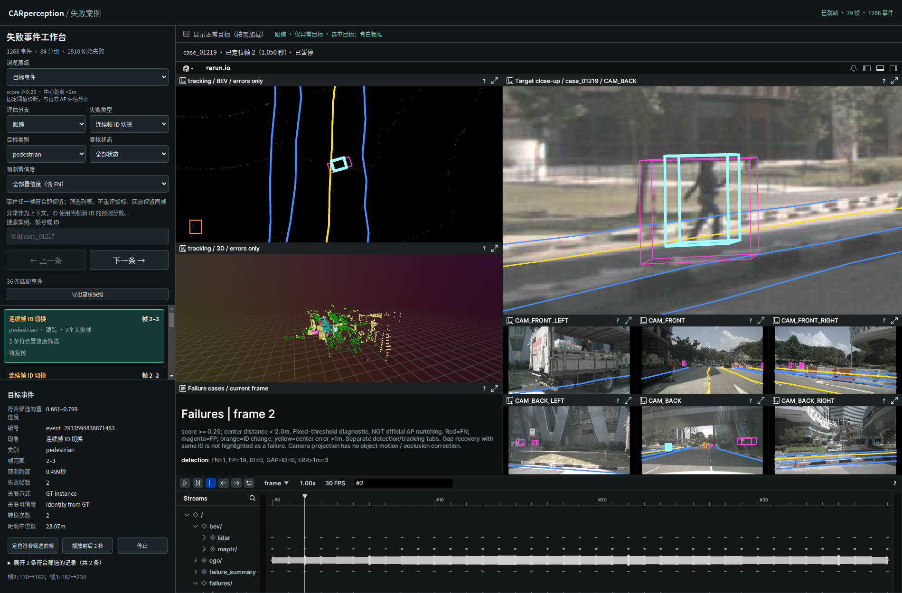
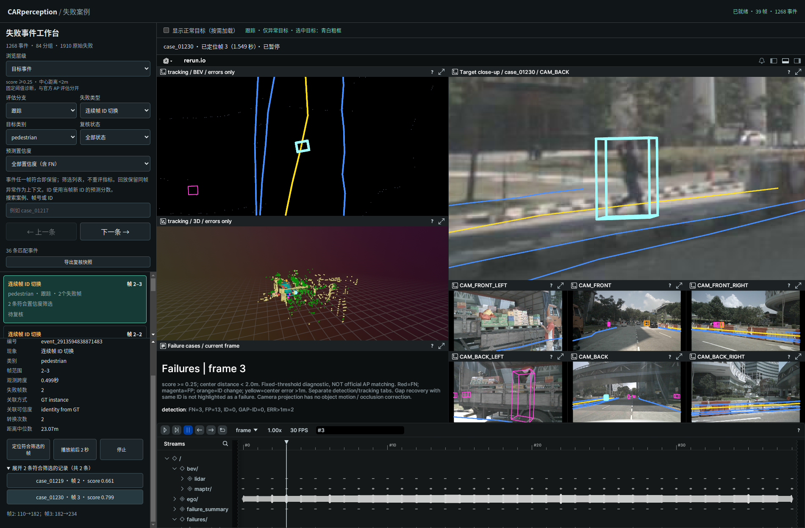

# 选中异常事件后居中放大

2026-09-29，scene-0061 的 39 帧教学工作台。

选中事件、逐帧案例或事件内成员后，右侧上方增加目标特写：按投影框面积选择一台相机，以投影框中心为视图中心。视野宽高取框包围矩形的 2.5 倍，至少 96 像素，兼顾目标与附近环境。右侧下方保留六路完整相机图。BEV 同时以目标框中心取景，宽高至少 12 米，否则采用目标框尺寸的 3 倍；3D 仍保留场景视角。

特写保留青白色高亮，不引入常驻编号。切换案例或事件内记录会重新计算取景；正常目标开关仍保留当前目标。没有相机投影时不生成相机特写，只使用 BEV 局部视图。边缘目标仍严格居中，视图超出原图的部分可能留白。

这是原始图像的显示放大，不增加真实细节，也不重新执行目标检测。相机选择依据投影面积，不包含遮挡或画质判断。特写取景对应当前选中记录；上下文片段播放不会逐帧自动追随目标，需点击下一条记录更新取景。

实现：`triage_views.py` 中 `focus_bounds` / `focus_camera` / `blueprint` 使用 Rerun `VisualBounds2D` 设置视野；`selection_blueprint.py` 传入已验证的目标几何。服务缓存加入布局代码哈希，避免刷新后仍读取旧布局。本次复用现有几何和录制，无需重新推理或导出主场景。

## 验证与复现

```bash
python3 perception_lab/tools/start_case_browser.py --stop
python3 perception_lab/tools/start_case_browser.py --no-browser
perception_lab/envs/mmdet3d/bin/python -m unittest discover -s perception_lab/tests -p 'test_*.py'
/usr/bin/python3 perception_lab/tests/browser_selection.py --out /tmp/car_focus
/usr/bin/python3 perception_lab/tests/check_focus_screenshot.py --directory /tmp/car_focus
```

57 项 Python 测试通过，包含小目标留边、边缘目标居中、相机选择及无相机情况。Browser plugin not available，使用系统 Playwright/Chrome 验证桌面 1900×1250 与窄屏 700×950，页面异常为空。原有选择切换、成员定位、正常目标开关、快速切换、FN 选择、空结果和分组清除回归通过，主场景只加载一次。

对 case_01219 帧 2 的截图测量：特写中高亮框中心为 (420,241)，视口中心 (420.5,241)，误差不超过 0.5 像素；BEV 中心误差也不超过 0.5 像素。特写框高度 198 像素，完整相机缩略图中为 16 像素，约放大 12.4 倍。这是该案例和该视口下的观测，不是所有目标的固定倍率。

证据：[居中与放大测量](focus_verification.json)、[交互验证](verification.json)、[测试日志](tests.log)。原录制与数据来源沿用[高亮功能报告](../selection_highlight/recording.json)。未验证其他浏览器，亦不构成模型精度评估。



