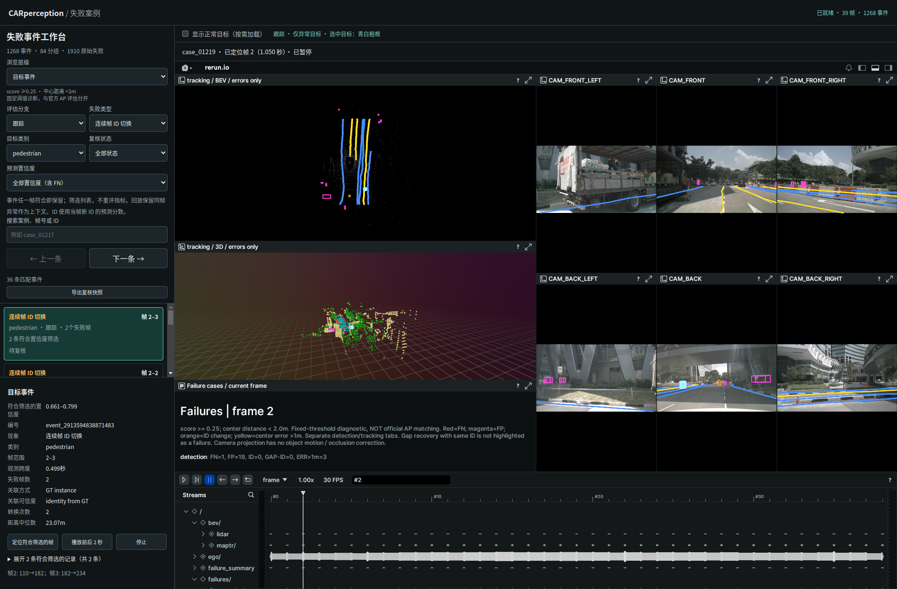
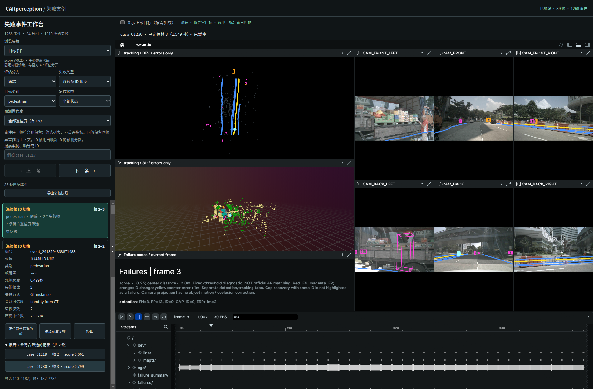
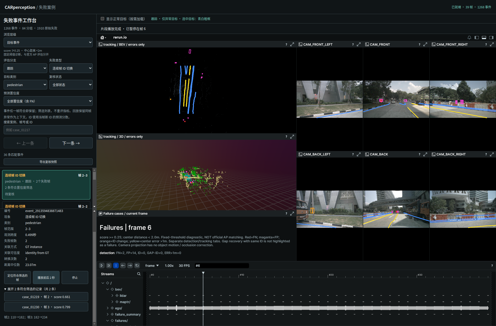

# 选中案例的跨视图高亮

2026-09-29。nuScenes mini scene-0061，39 帧，Rerun 0.23.4。

在左侧选择事件或逐帧案例后，自动跳到对应帧，并用青白色 `[160,255,255]`、半径 3 UI points 的框高亮目标。BEV、3D、以及目标可投影进入的相机视图同步显示。不恢复常驻大编号，其他异常保持原来的颜色和细线。

事件首先定位符合当前置信度条件的代表记录；展开原始记录后，点击其他记录会同时更新帧与高亮。正常目标开关保留当前选中目标。切换分组或筛选为空时取消高亮。快速切换采用最新请求，防止旧请求覆盖新选择。

高亮针对选中案例所在帧，在下一帧清除。事件片段播放保留上下文，但不会自动将这个框外推到其他帧，也不等于持续跟随整个轨迹。该功能的选择入口是左侧列表与事件成员，未新增画布点击反向选择列表的功能。

## 实现与数据口径

- `failure_overlay.py`：用现有 resolve_case 和相机投影导出 1910 条失败的高亮几何；FN 用 GT，FP 用预测框，其他诊断使用原诊断框。没有新增推理或修改评估。
- `rerun_mini.py --triage-only`：导出 `selection_geometry.json`，绑定录制 ID 与案例 SHA-256；主场景仍约 98 MiB。
- `selection_blueprint.py`：按需写出所选案例的高亮数据和视图布局，沿用主录制 ID。记录目标帧与下一帧 Clear；最后一帧不扩展时间轴。
- `start_case_browser.py`：校验案例编号、分支及录制版本后生成并缓存选择文件；参数用 subprocess 参数列表传递，路径受固定格式约束。首个实测案例文件约 96 KB。
- `triage_views.py`：每个布局只包含当前选中案例的高亮路径，因此旧案例的数据即使已缓存也不会同时显示。
- `display_layers.mjs` / `event_ui.js` / `app.js`：串联选择、异步加载、布局切换、时间定位与正常目标开关。

录制及几何来源见 [recording.json](recording.json)。大型本地录制、几何文件和按需缓存不提交 Git；可由代码复现。

## 复现

```bash
perception_lab/envs/rerun/bin/python perception_lab/tools/rerun_mini.py --triage-only
python3 perception_lab/tools/start_case_browser.py --stop
python3 perception_lab/tools/start_case_browser.py --no-browser
node --experimental-modules perception_lab/tests/test_display_layers.mjs
perception_lab/envs/mmdet3d/bin/python -m unittest discover -s perception_lab/tests -p 'test_*.py'
/usr/bin/python3 perception_lab/tests/browser_selection.py --out /tmp/car_selection
```

## 验证

- 54 项 Python 测试通过；新增选择路径和错误编号测试先失败后通过。
- JavaScript 选择请求、保留当前帧、正常目标切换与异步取消测试通过；补充 A→B→A 快速切换回归，先复现旧布局残留，再修复并通过。
- Browser plugin not available，使用系统 Playwright/Chrome。1900×1250 与 700×950 页面正常，页面异常为空。
- 实际选择 case_01219 定位帧 2，再点击成员 case_01230 定位帧 3；BEV、3D 与相机视图均出现高亮。截图中三类区域的高亮像素数分别为 `[57, 42, 238]`、`[53, 41, 173]`；片段结束后均为 0，证明没有保留静止高亮框。
- 验证正常目标切换、空结果及分组清除、快速最后选择生效、FN 选择和错误分支请求被拒绝。整个交互中主场景仅请求一次。
- 原置信度筛选浏览器回归通过。验证记录见 [verification.json](verification.json)、[confidence_verification.json](confidence_verification.json)、[测试日志](tests.log)。

范围：局部教学诊断、Chrome、frame 时间轴；没有验证其他浏览器和规划/控制效果。首次选中一个尚未缓存的案例需要本地生成小文件，存在短暂加载时间。




