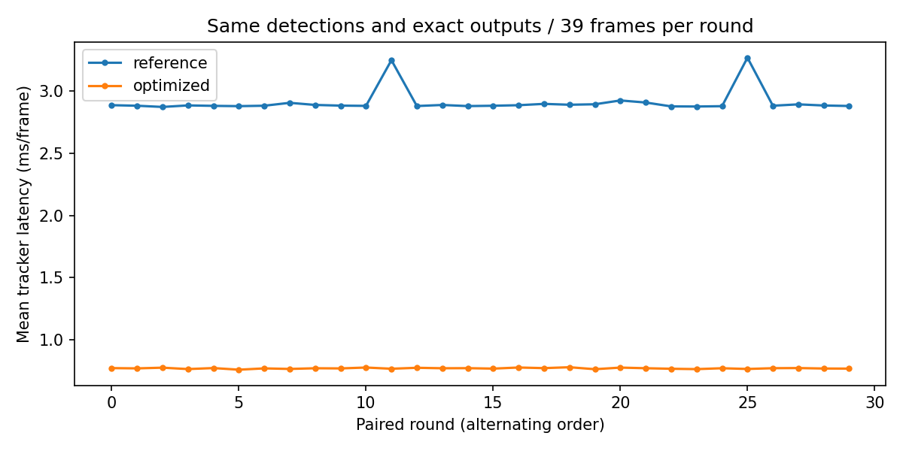

# 跟踪候选 CPU 算子与数据路径优化

日期：2026-09-30。对象是上一阶段 **S4_greedy_low** 候选，不是CenterPoint网络的CUDA/TensorRT算子。本轮保留同样的关联策略、max_age、门限、置信度规则和诊断日志。默认回放仍未切换。

## 结果

| 指标 | 参考实现 | 优化实现 |
|---|---:|---:|
| 平均 ms/帧 | 2.910 | 0.772 |
| P50 ms/帧 | 2.855 | 0.777 |
| P95 ms/帧 | 4.219 | 1.022 |
| 每种实现计时样本 | 1170 | 1170 |

平均加速 **3.77×**，平均延迟下降 **73.5%**。这只是跟踪函数本身的耗时，不能推算整条感知流水线加速比例。

## 优化内容

1. **已知输入结构的复制快路径**：对数值列表/数组复制存储，省去递归遍历每个标量；出现额外字段、嵌套结构等情况仍回退deepcopy。不是浅拷贝共享可变坐标，测试确认输出修改不会改变输入。
2. **批量坐标与速度计算**：一次构建数组，保留参考实现的float32转换位置与计算顺序；不降精度。
3. **类别矩阵广播**：将N×M次Python字符串比较替换为类别编码广播。
4. **二维距离计算**：分别计算dx和dy，避免N×M×2临时数组；保留逐项平方求和的语义。
5. **两阶段贪心复用代价矩阵**：高分行先遍历，低分行随后遍历，已使用列统一屏蔽；不再构造两次阶段子矩阵及复制。行/列顺序及相同代价的选择保持不变。
6. **诊断筛选向量化**：用布尔归约替代每个未匹配框遍历全部轨迹；日志字段、顺序和距离不变。

[参考热点](profile_reference.txt)显示deepcopy是主要开销；[优化后热点](profile_optimized.txt)保留完整可复核结果。Profiler会引入额外开销，其耗时不作为上表的性能数据。

## 正确性与测试

- 39帧、4547个输入框，返回轨迹（含未激活旧轨迹）的全部字段、顺序、ID与诊断逐帧精确一致。
- 输入在运行后未被修改；优化结果转换回自车坐标后与上一阶段压缩归档逐项精确一致。
- 因此既有候选的全类连续ID切换38、间隔后换ID37、FP579、FN39保持不变；没有重训练或调节策略换取速度。
- [72项测试通过](tests.txt)，新增测试覆盖80帧固定随机输入、相等代价、阈值边界、空帧/过期、类别、低分、重置、输出隔离与嵌套扩展字段。

## 计时协议

CPU：Intel(R) Core(TM) i9-14900KF；NumPy 1.26.2，SciPy 1.11.4。完整环境和代码/输入哈希见[summary.json](summary.json)。

同一进程内，先做正确性检查，每种实现预热3次完整场景，再运行30轮，每轮交替先后顺序；每种实现共39×30=1170个帧样本。计时包含函数内复制、关联及诊断，排除加载、坐标转换、序列化、评估、渲染和磁盘输出。保留Python正常运行环境，不声明CPU独占或硬实时保证。

上一阶段实验入口额外在调用前deepcopy，本轮对两种实现均直接传入只读使用的同一输入。故应比较本表中的配对结果，不与上一轮报告的单次耗时直接相除。各帧与各轮不是独立场景样本；未进行显著性推断。未测试大规模目标拥挤场景、其他硬件或GPU实现。

## 使用与复现

优化类仅针对该候选，无匈牙利/Kalman开关；其他实验继续使用参考实现。

```python
from fast_candidate_tracker import FastCandidateTracker
tracker = FastCandidateTracker(max_age=3)
tracks = tracker.step_centertrack(detections_global, time_lag_seconds)
# 新场景开始时调用 tracker.reset()
```

在项目根目录执行：

```bash
perception_lab/envs/mmdet3d/bin/python -m unittest discover -s perception_lab/tests
perception_lab/envs/mmdet3d/bin/python perception_lab/tools/benchmark_tracker_operators.py
perception_lab/envs/mmdet3d/bin/python perception_lab/reports/tracking_operator_optimization/build_report.py
```

[实现](../../tools/fast_candidate_tracker.py)、[基准入口](../../tools/benchmark_tracker_operators.py)、[逐帧样本](samples.csv)、[逐轮均值](rounds.csv)、[实施说明](../../instruction/20260930_02_tracking_operator_optimization.md)。

后续可用该优化类运行更多mini场景验证，但当前仍不宣称完成跨场景精度验证。若继续优化模型推理算子，应单独测CenterPoint分阶段GPU耗时后再选择目标。


